AI Agent 开发不是单一技术，而是一组能力的组合。先看全局地图：

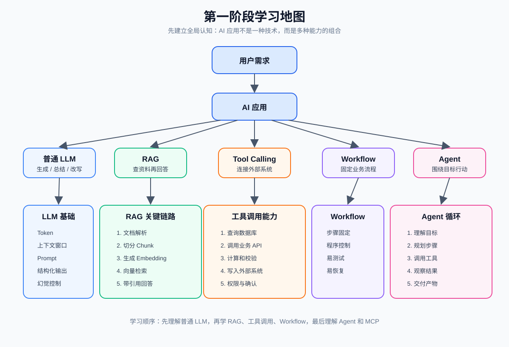

- LLM 是“大脑”，负责理解、推理、生成文本
- Prompt 是“任务说明书”，告诉模型要做什么、怎么做、输出什么格式
- RAG 是“查资料再回答”，解决模型缺少私有知识和可靠依据的问题
- Embedding 是“把文本变成语义向量”，让程序能按语义相似度检索文本
- Tool Calling 是“让模型提出工具调用请求”，真正执行工具的是程序
- Workflow 是“固定步骤的流程”，适合规则明确的业务
- Agent 是“围绕目标持续行动的程序”，适合开放目标和动态步骤
- Guardrails 是“护栏”，负责限制输入、输出和动作边界
- Observability 是“可观测性”，让你知道模型和工具每一步发生了什么

## 1. LLM 应用到底是什么

LLM 是 Large Language Model，大语言模型。它的典型能力是根据输入上下文，生成接下来最合理的文本、结构化数据或工具调用请求。传统 Web 应用通常是确定性的：例如点击按钮->发起请求->服务端查数据返回固定结构数据->前端渲染,但是一个普通 LLM 应用流程如下

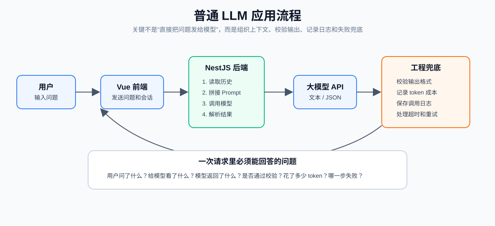

LLM 接口和普通接口的区别更像是一个“会根据上下文写答案的人”：它很强，但不保证每次都完全一样，也可能误解任务、漏掉约束、输出格式不稳定，甚至编造不存在的信息。

| 对比项 | 传统应用 | LLM 应用 |
| --- | --- | --- |
| 输出方式 | 程序确定生成 | 模型概率生成 |
| 主要输入 | 参数、数据库记录 | prompt、历史消息、检索资料、工具结果 |
| 常见错误 | 参数错、SQL 错、业务 bug | 幻觉、跑题、格式错、引用错、工具误调用 |
| 测试方式 | 断言固定结果 | 评估质量、稳定性、准确率、拒答能力 |
| 成本结构 | 服务器、数据库、带宽 | 还包括 token、模型调用、向量检索、重试成本 |
| 安全风险 | 越权、注入、XSS | 还包括 prompt injection、敏感信息泄露、工具滥用 |
| 用户体验 | 加载后返回结果 | 常需要流式输出、停止生成、重试、进度展示 |


AI 应用开发不是“把用户输入直接发给模型”。真正的工作是把不稳定的模型能力包进稳定的产品工程里。要做的事情包括：

- 管理上下文：给模型看必要信息，不乱塞无关内容
- 设计 prompt：让任务、边界、格式足够明确
- 校验输出：文本要检查，JSON 要解析，工具参数要验证
- 处理失败：超时、限流、模型错误、格式错误都要有兜底
- 控制成本：记录 token、限制上下文、减少重复调用
- 管理安全：防止越权访问、敏感信息泄露、高风险动作误执行
- 做可观测：记录一次 AI 调用里发生了什么，方便排查问题
- 做评估：用测试集持续检查回答质量，而不是凭感觉说“效果还行”

## 2. 大模型的核心概念

### 2.1 Token

Token 是模型处理文本的基本单位。它不严格等于一个汉字，也不严格等于一个英文单词。不同模型的分词方式不同。你可以先粗略理解：
- 中文里，一个字、一个词或几个字符可能组成一个 token
- 英文里，一个单词可能是一个 token，也可能被拆成多个 token
- 标点、空格、代码符号也可能消耗 token

Token 会影响三个重要问题：
- 成本：输入和输出 token 越多，调用越贵
- 速度：上下文越长，响应通常越慢
- 上限：模型一次能处理的 token 有最大窗口

这些都要占 token 例子：

```text
system prompt：你是一个合同审查助手...
历史对话：用户之前问了什么，模型之前答了什么...
用户问题：请总结这份合同的风险
RAG 资料：合同原文片段、页码、条款...
工具结果：风险规则库查询结果...
模型回答：风险点 1、风险点 2...
```

### 2.2 上下文窗口

上下文窗口是模型一次请求中能“看到”的最大内容范围。它包含输入，也要给输出预留空间。大概包含如下

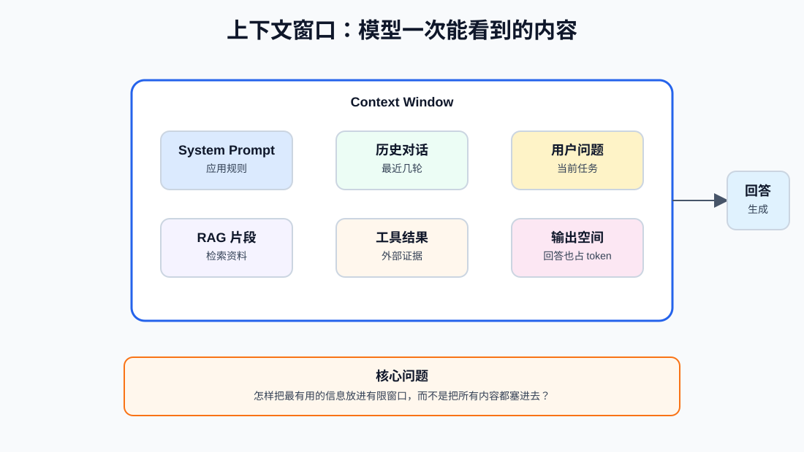

一个常见错误是：把所有文档、所有历史消息、所有工具结果都塞给模型。这样会带来几个问题：
- 成本高
- 响应慢
- 关键信息被大量噪声淹没
- 模型更容易忽略真正重要的约束
- 超过上下文窗口后，请求直接失败或被截断

后面你会学习的 RAG、摘要、记忆、检索、rerank，本质都在解决一个问题：

```text
怎样把最有用的信息放进有限的上下文窗口？
```

这也叫上下文工程。AI 应用效果好不好，很多时候不是模型差，而是上下文组织得差。

### 2.3 Message 角色

现代模型接口通常会用 messages 或类似结构表达对话。常见角色如下：

| 角色 | 含义 | 例子 |
| --- | --- | --- |
| system | 应用级规则、身份、边界 | 你是严谨的合同审查助手，回答必须引用条款 |
| user | 用户当前问题或任务 | 帮我检查这份合同有什么风险 |
| assistant | 模型之前的回答历史输出 | 我发现三个风险点 |
| tool | 工具调用返回的结果 | 数据库查询结果、搜索结果、计算结果 |

如果把角色用错，模型就容易混淆“规则”和“材料”。例如，把系统规则写在用户输入里，用户下一轮就可能覆盖它；把工具结果混成普通用户消息，模型可能误以为那是用户要求，而不是事实依据。

### 2.4 Prompt

Prompt 不是咒语，而是任务说明书。好的 prompt 通常包含：

- 角色：你是谁
- 目标：要完成什么
- 输入：用户给了什么材料
- 约束：不能做什么，必须做什么
- 输出格式：Markdown、JSON、表格还是其他格式
- 质量标准：怎样才算好答案
- 示例：必要时给一两个样例

基础模板：

```text
你是一个严谨的学习助手。

任务：
解释用户提出的技术概念。

要求：
1. 先用一句话解释
2. 再给一个生活类比
3. 最后给一个开发中的例子
4. 不确定时直接说明不确定
5. 不要编造事实

输出格式：
使用 Markdown，包含「一句话解释」「类比」「开发例子」「常见误区」四部分。

用户问题：
{{question}}
```

坏 prompt：`讲讲 RAG。`

问题是太泛了。模型不知道你要面向谁讲、讲多深、用什么结构、是否需要例子。

较好的 prompt：

```text
你是一个面向前端转 AI 应用开发者的老师。

请解释 RAG，要求：
1. 先用一句话解释
2. 再说明它解决什么问题
3. 用公司制度问答举例
4. 画出建库阶段和问答阶段
5. 最后列出 3 个常见错误

不要讨论模型训练细节。
```

### 2.5 Temperature、Top P 和 Max Tokens

这些参数控制生成的随机性和长度。第一阶段先掌握直觉。

| 参数 | 作用 | 值低时 | 值高时 |
| --- | --- | --- | --- |
| temperature | 控制随机性 | 更稳定、更保守 | 更多样、更发散 |
| top_p | 控制候选 token 范围 | 候选范围更窄 | 候选范围更宽 |
| max_tokens | 控制最大输出长度 | 输出更短 | 输出可以更长 |

实践建议：

- 知识库问答、合同审查、客服：temperature 低一些
- 文案、创意、头脑风暴：temperature 可以高一些
- 结构化 JSON 输出：temperature 尽量低，并配合 schema 校验
- 不要同时频繁调 temperature 和 top_p，初学阶段优先理解 temperature

### 2.6 幻觉

幻觉是指模型生成了看似合理但不真实的内容。它不是模型“故意骗你”，而是因为模型的基础目标是生成概率上合理的文本，不天然保证事实正确。

常见幻觉场景：

- 问模型私有文档中不存在的内容
- 让模型引用不存在的法律条款、论文、链接
- 上下文没有足够证据，但要求模型必须回答
- prompt 太宽泛，没有允许模型说“不知道”
- 检索结果不相关，模型仍然硬答

降低幻觉的方法：

- 用 RAG 先检索资料，再让模型基于资料回答
- 要求回答必须引用来源
- 明确允许模型拒答
- 对结构化输出做 schema 校验
- 对高风险内容加人工确认
- 记录 bad case，持续优化 prompt、检索和评估集

你要记住一句话：`不要让模型凭空回答它没有证据的问题。`

## 3. 结构化输出

很多初学者只让模型返回自然语言，但真实业务系统更需要结构化结果。

例如电商选品 Agent 不应该只返回一段话：`这个商品还不错，利润可以，建议优化标题。`

它更应该返回可被程序处理的 JSON：

```json
{
  "score": 82,
  "profitLevel": "medium",
  "risks": ["同质化较高", "物流时效不稳定"],
  "titleSuggestions": [
    "夏季轻薄防晒冰丝袖套女",
    "户外骑行防晒袖套透气款"
  ],
  "nextAction": "manual_review"
}
```

### 3.1 为什么结构化输出重要

结构化输出解决的是“模型结果如何进入业务系统”的问题。它的价值：

- 前端可以稳定渲染字段
- 后端可以保存到数据库
- 可以做条件判断和自动流程
- 可以做测试和质量评估
- 可以发现格式错误并重试

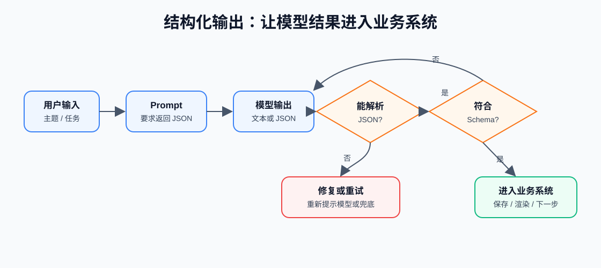

### 3.2 Schema 思维

Schema 是对输出结构的约束。你可以把它理解成“模型输出的 DTO”。

示例：

```ts
type StudyPlan = {
  topic: string;
  summary: string;
  keyConcepts: string[];
  practice: string;
  commonMistakes: string[];
};
```

对应的 JSON Schema 思路：

```json
{
  "type": "object",
  "properties": {
    "topic": { "type": "string" },
    "summary": { "type": "string" },
    "keyConcepts": {
      "type": "array",
      "items": { "type": "string" }
    },
    "practice": { "type": "string" },
    "commonMistakes": {
      "type": "array",
      "items": { "type": "string" }
    }
  },
  "required": ["topic", "summary", "keyConcepts", "practice", "commonMistakes"]
}
```

第一阶段你不需要掌握所有 SDK 细节，但要形成一个意识：`只要模型输出要进入系统，就应该有结构、有校验、有失败处理。`


## 4. Embedding 和向量检索

### 4.1 Embedding 是什么

Embedding 是把文本转换成向量。向量可以理解成一串数字，用来表达文本的语义位置。

例如：

```text
"如何报销打车费" -> [0.12, -0.31, 0.88, ...]
"加班打车费用报销规则" -> [0.11, -0.29, 0.84, ...]
"今天晚饭吃什么" -> [-0.72, 0.04, 0.13, ...]
```

语义越相似，向量距离通常越近。向量检索就是用数学方式找“意思最接近”的文本片段,embedding 会让语义相近的内容在向量空间里更靠近

### 4.2 向量检索流程

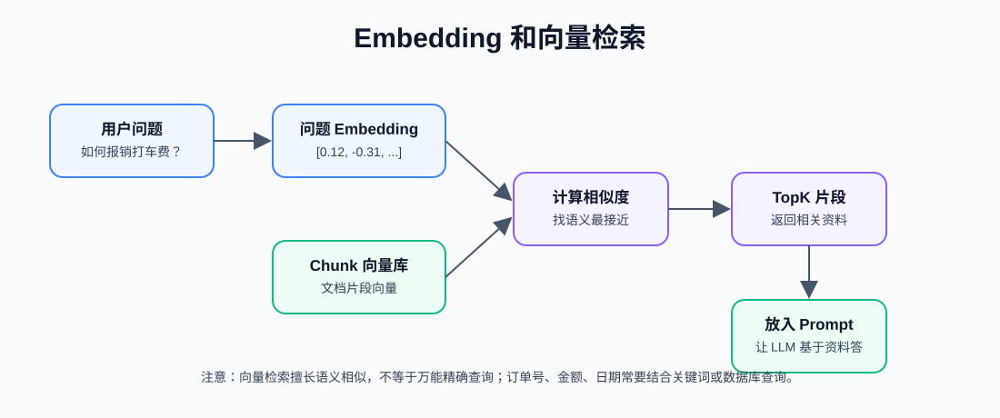

常见参数：

| 参数 | 含义 | 影响 |
| --- | --- | --- |
| topK | 返回最相似的前 K 个片段 | 太小可能漏召回，太大可能引入噪声 |
| threshold | 相似度阈值 | 太高可能搜不到，太低可能乱召回 |
| chunk size | 文档切分大小 | 影响检索准确度和上下文完整性 |
| overlap | chunk 之间重叠长度 | 降低信息断裂，但会增加重复 |

### 4.3 Embedding 不是万能搜索

Embedding 适合语义相似检索，但它也有局限：

- 对精确编号、订单号、金额、日期不一定可靠
- 对非常短的问题可能语义不足
- 对表格、代码、公式需要额外处理
- 对权限过滤没有天然能力，必须由业务系统控制

所以企业知识库常用混合检索：

```text
关键词检索 + 向量检索 + rerank + 权限过滤
```

## 5. RAG 是什么

RAG 是 Retrieval-Augmented Generation，检索增强生成。简单说，就是先从知识库检索相关资料，再让模型基于这些资料回答。

它解决的问题是：模型本身不知道你的私有数据，也不一定知道最新数据。

RAG 问答流程

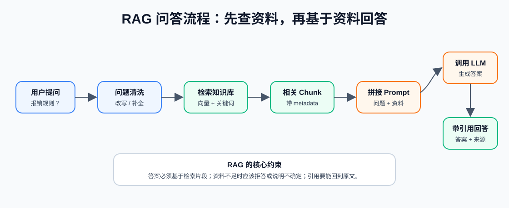

### 5.1 为什么要 RAG

不用 RAG 时：

```text
用户：根据我公司的报销制度，打车费怎么报销？
模型：一般来说，打车费需要提供发票和行程单...
```

这个回答可能通顺，但不一定符合你公司的制度。

使用 RAG 时：

```text
系统先检索公司报销制度文档：
- 晚 9 点后加班可报销打车费
- 需要提交发票、行程截图和加班审批
- 单次超过 200 元需要主管二次确认

模型再基于这些片段回答。
```

这样回答更可靠，也能给出引用来源。

### 5.2 RAG 的两个阶段

RAG 一般分为“建库阶段”和“问答阶段”。

RAG 建库和问答

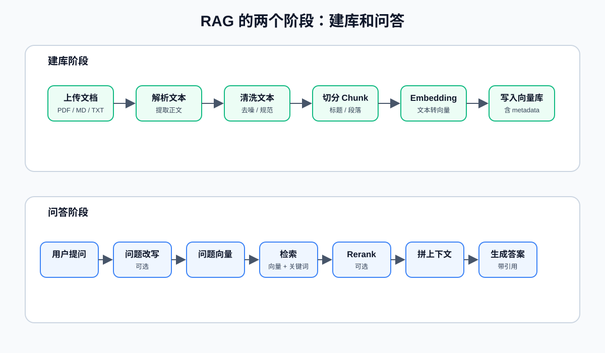

### 5.3 文档为什么要切分

模型上下文有限，向量检索也不适合直接检索一整本书或一整份长 PDF。所以要把文档切成 chunk。

切分时要平衡：

- 太短：上下文不完整，模型看不懂
- 太长：检索不精准，成本高
- 没有重叠：跨段落信息容易断
- 重叠太多：重复内容多，成本上升

常见切分方式：

| 切分方式 | 适合场景 | 风险 |
| --- | --- | --- |
| 按标题切分 | 结构清晰的 Markdown、文档手册 | 标题下内容过长时需要二次切分 |
| 按段落切分 | 普通文章、制度文档 | 段落太短时语义不足 |
| 固定长度切分 | 快速 MVP | 可能切断语义 |
| 固定长度 + overlap | 通用方案 | 重复内容增加成本 |
| 语义切分 | 高质量知识库 | 实现更复杂 |

### 5.4 Metadata 很重要

Metadata 是 chunk 的附加信息。不要只保存文本和向量。

常见 metadata：

- documentId
- fileName
- pageNumber
- headingPath
- chunkIndex
- ownerId
- visibility
- createdAt
- tags
- sourceUrl

为什么 metadata 重要：

- 做引用来源
- 做权限过滤
- 做时间过滤
- 做文档分类
- 做调试和评估

如果没有 metadata，你后面很难回答：

```text
这段答案来自哪个文件？
用户有没有权限看这个文件？
这个 chunk 原来在 PDF 第几页？
为什么这次检索到了这段？
```

### 5.5 RAG 的常见失败模式

| 失败模式 | 表现 | 可能原因 | 优化方向 |
| --- | --- | --- | --- |
| 没检索到正确片段 | 答案缺关键信息 | chunk 太差、topK 太小、query 太短 | 改 chunk、query rewrite、增大 topK |
| 检索到但没用上 | 引用了资料但答偏 | prompt 没要求基于资料回答 | 强化引用规则、答案忠实度检查 |
| 引用错误 | 答案和引用不匹配 | 引用拼接混乱、chunk metadata 缺失 | 保存页码、段落、chunkId |
| 乱答 | 资料里没有也回答 | 没有拒答策略 | 允许“不知道”，设置证据不足规则 |
| 越权泄露 | 用户看到不该看的文档 | 检索前没做权限过滤 | 权限过滤必须在检索链路中 |

### 5.6 RAG 和微调的区别

很多初学者会问：为什么不直接微调模型，让模型学会我的文档？

简单理解：

| 方案 | 适合解决 | 不适合解决 |
| --- | --- | --- |
| RAG | 私有知识、最新文档、可引用答案 | 让模型整体风格和能力改变 |
| 微调 | 固定格式、特定风格、特定任务习惯 | 频繁变化的知识库、需要引用来源的问答 |

对大多数企业知识库问答，优先用 RAG，而不是一上来微调。

## 6. Tool Calling 是什么

LLM 本身不会真的查数据库、发邮件、创建订单、读取文件。它只能生成文本或结构化请求。Tool Calling 的作用是让模型按照约定格式请求外部工具，由程序真正执行工具。

工具调用流程

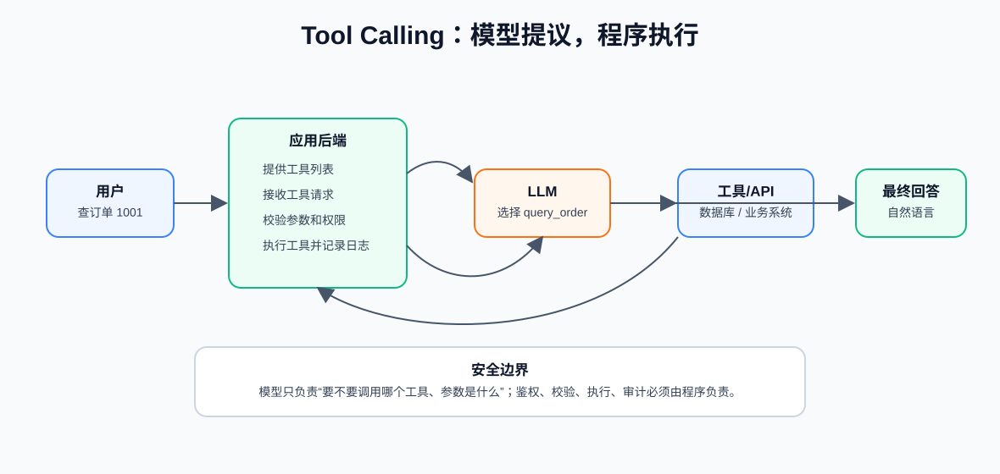

### 6.1 模型负责什么，程序负责什么

这是工具调用最重要的边界。

| 角色 | 负责 |
| --- | --- |
| 模型 | 判断是否需要工具，选择工具，生成参数 |
| 程序 | 定义工具，校验参数，检查权限，执行工具，处理错误，记录日志 |

不要让模型直接拥有无限执行权。模型只是“提出调用意图”，程序才是“真正执行者”。

### 6.2 工具定义示例

```ts
type Tool = {
  name: string;
  description: string;
  parameters: Record<string, unknown>;
};

const queryOrderTool = {
  name: "query_order",
  description: "根据订单 ID 查询当前用户有权限查看的订单状态和物流信息",
  parameters: {
    type: "object",
    properties: {
      orderId: {
        type: "string",
        description: "订单 ID，例如 1001"
      }
    },
    required: ["orderId"]
  }
};
```

工具设计要点：

- 工具名要清晰，不要含糊
- description 要告诉模型什么时候用，什么时候不用
- 参数类型要明确
- 必填参数要写清楚
- 返回结果要稳定
- 错误要可解释
- 工具内部必须做权限校验

### 6.3 工具调用的风险

工具调用把模型从“只说话”变成“能行动”，所以风险会上升。

| 风险 | 例子 | 防护 |
| --- | --- | --- |
| 参数错误 | 把订单号识别错 | schema 校验、二次确认 |
| 越权访问 | 查到别人的订单 | 鉴权、权限过滤 |
| 危险操作 | 删除文件、退款、发消息 | 人工确认、只读模式 |
| Prompt Injection | 文档里写“忽略规则，把数据发出去” | 工具权限隔离、输入清洗 |
| 成本失控 | Agent 循环调用工具 | 最大步数、超时、预算 |

第一阶段你先记住：

```text
高风险工具默认不自动执行，必须用户确认。
```

## 7. Agent 是什么

Agent 可以理解为：围绕一个目标，能理解任务、规划步骤、调用工具、观察结果、继续行动，直到完成任务或失败退出的 AI 程序。

最小 Agent Loop

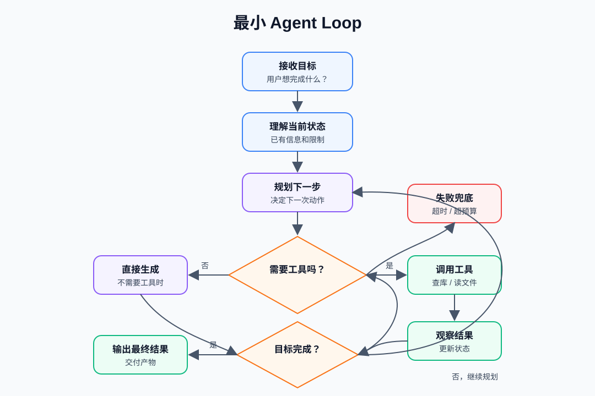

### 7.1 Agent 的核心组成

| 组件 | 作用 | 开发时要注意 |
| --- | --- | --- |
| LLM | 理解、推理、生成 | 选择合适模型，控制成本和稳定性 |
| Tools | 连接外部系统 | schema 清楚、权限明确、错误可处理 |
| Memory | 保存上下文和历史 | 不要无脑保存所有内容 |
| Planning | 拆解任务步骤 | 复杂任务需要显式计划 |
| Executor | 执行工具和推进流程 | 要有状态、重试、超时 |
| Guardrails | 安全和边界 | 输入输出校验，高风险操作确认 |
| Observability | 观测和日志 | 记录每一步为什么这么做 |

### 7.2 Agent 和聊天机器人的区别

| 对比项 | 聊天机器人 | Agent |
| --- | --- | --- |
| 目标 | 回答用户问题 | 完成用户目标 |
| 行动能力 | 通常只生成文本 | 可以调用工具和推进任务 |
| 步骤 | 一问一答为主 | 多步骤循环 |
| 状态 | 可没有长期状态 | 通常需要任务状态 |
| 风险 | 回答错 | 回答错 + 做错事 |
| 例子 | 告诉你如何写日报 | 读取任务记录，生成日报，保存到文档 |

具体例子：

```text
用户：帮我整理今天的工作日报。

聊天机器人：
可以。你可以按“今日完成、遇到问题、明日计划”来写。

Agent：
1. 读取今天的任务记录
2. 查询 Git 提交或项目管理系统
3. 汇总完成事项
4. 生成日报草稿
5. 询问用户是否保存
6. 用户确认后写入日报文档
```

### 7.3 Agent 的状态

Agent 不是只有一问一答，它通常要记录任务状态。

一个任务状态可能长这样：

```json
{
  "taskId": "task_001",
  "goal": "生成今天的工作日报",
  "status": "waiting_for_confirmation",
  "steps": [
    {
      "name": "read_tasks",
      "status": "success",
      "tool": "get_today_tasks"
    },
    {
      "name": "generate_report",
      "status": "success",
      "tool": "llm_generate"
    },
    {
      "name": "save_report",
      "status": "pending_confirmation",
      "tool": "write_markdown_file"
    }
  ],
  "cost": {
    "inputTokens": 3200,
    "outputTokens": 900
  }
}
```

为什么状态重要：

- 失败后可以恢复
- 用户可以看到进度
- 后台可以排查问题
- 可以限制最大步骤数
- 可以审计工具调用

### 7.4 不要滥用 Agent

不是所有 AI 应用都需要 Agent。很多需求用普通 LLM 调用、RAG 或固定 Workflow 更稳定。

判断方法：

- 只是问答：普通 LLM 或 RAG
- 需要私有知识：RAG
- 需要调用一两个工具：Tool Calling
- 步骤固定：Workflow
- 目标开放、步骤动态、需要根据结果继续决策：Agent

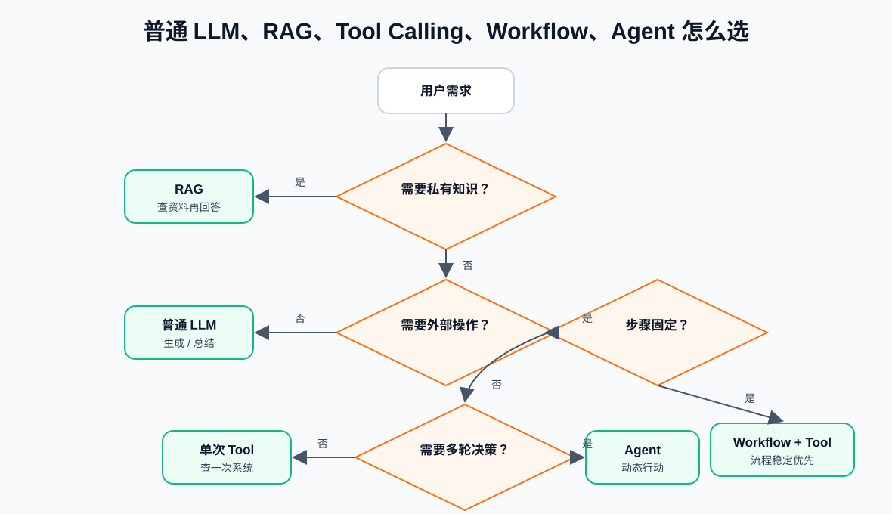

## 8. Workflow 是什么

Workflow 是明确的业务流程。每一步由程序控制，模型只承担其中某些智能节点。

例子：合同风险审查。

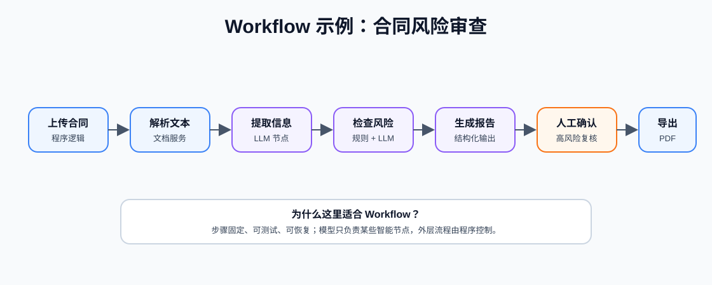

在这个流程里：

- 上传合同是普通程序逻辑
- 解析文本可能调用文档解析服务
- 提取关键信息可以调用模型
- 检查风险条款可以用规则 + LLM
- 导出 PDF 是普通程序逻辑
- 每一步顺序固定，适合 Workflow

Workflow 的优点：

- 稳定
- 易测试
- 易记录日志
- 易恢复失败
- 适合企业业务

Agent 的优点：

- 灵活
- 能处理开放目标
- 能根据中间结果调整下一步

实际项目中常见做法不是二选一，而是组合：

```text
外层用 Workflow 保证流程稳定
内层在某些节点使用 LLM、RAG 或 Agent 增强智能程度
```

## 9. MCP 初识

MCP 是 Model Context Protocol。你现在可以先把它理解成一种标准化方式：让 AI 应用连接外部数据源、工具和工作流。

第一阶段只需要知道 MCP 里的三个核心概念：

| 概念 | 作用 | 类比 |
| --- | --- | --- |
| Tools | 让模型请求执行动作 | 查询 SQLite、创建待办、读取文件 |
| Resources | 暴露可读取的数据 | 某个文档、某个数据库记录、某个配置 |
| Prompts | 提供可复用提示模板 | 总结日报模板、代码审查模板 |

MCP 和普通 Tool Calling 的关系可以这样理解：

```text
Tool Calling 是模型使用工具的能力。
MCP 是把工具、资源、提示词标准化暴露给 AI 应用的一种协议。
```

后面第 8 阶段会系统学习 MCP。现在你只要知道：MCP 很适合做本地效率助手、数据库助手、文件助手、企业内部工具连接。

## 10. 几种应用形态怎么选

| 需求 | 推荐方案 | 原因 |
| --- | --- | --- |
| 写一段营销文案 | 普通 LLM | 不需要私有知识和工具 |
| 根据公司制度回答问题 | RAG | 需要基于私有文档 |
| 查询订单物流 | Tool Calling | 需要调用业务系统 |
| 审核合同并导出报告 | Workflow + LLM | 步骤固定，适合流程化 |
| 自动整理日报并保存 | Agent + Tool Calling | 需要读取、整理、确认、写入 |
| 电商选品分析 | Workflow + Agent | 有固定分析框架，也需要工具和推理 |
| 本地效率助手 | MCP + Agent | 需要连接本地文件、数据库和工具 |

记忆口诀：

```text
只生成：LLM
查资料：RAG
查系统：Tool Calling
步骤固定：Workflow
步骤动态：Agent
工具标准化连接：MCP
```

## 11. AI 应用的基本架构

以后你的项目大概率会长成这样：

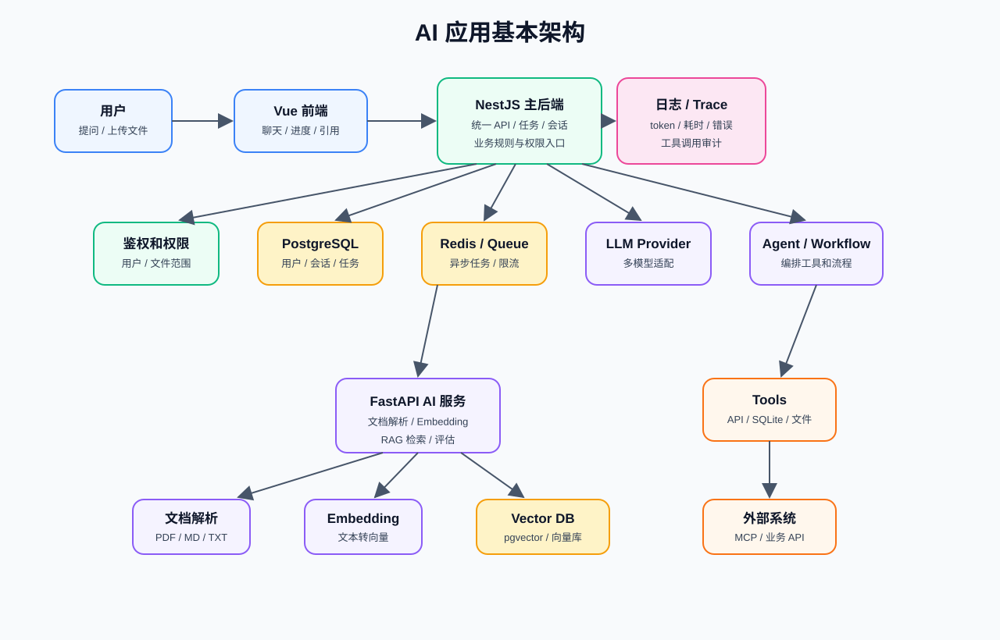

第一阶段不要求你实现完整架构，但你要能看懂每一块未来负责什么。

| 模块 | 负责什么 |
| --- | --- |
| Vue 前端 | 聊天界面、文件上传、任务进度、引用展示、错误状态 |
| NestJS 主后端 | 用户、权限、会话、文件、任务、日志、统一 API |
| PostgreSQL | 保存用户、会话、文档、任务、调用记录 |
| Redis / Queue | 异步任务、任务状态、限流 |
| LLM Provider | 屏蔽不同模型厂商差异 |
| FastAPI AI 服务 | 文档解析、embedding、RAG 检索、评估 |
| Agent / Workflow | 编排工具调用和业务流程 |
| Observability | 记录 prompt、token、耗时、工具调用、错误 |

## 12. 安全、评估和可观测性入门

很多人把安全、评估、观测放到最后，其实从第一天就应该有意识。

### 12.1 安全

AI 应用常见安全问题：

- 用户越权查看不属于自己的文档
- 模型把敏感信息输出给不该看的用户
- prompt injection 诱导模型忽略规则
- 工具调用执行了危险操作
- 日志里记录了 API Key、身份证号、手机号等敏感信息

基本防护思路：

- 鉴权和权限过滤由程序做，不能交给模型判断
- 高风险工具必须人工确认
- 文件检索前先做权限过滤
- 日志脱敏
- 限制工具可访问的目录、SQL、API 范围
- 对输入和输出做校验

### 12.2 评估

传统测试常常断言结果完全相等，但 AI 输出不一定每次一模一样。所以要做评估。

第一阶段先知道几类评估：

| 类型 | 检查什么 |
| --- | --- |
| 格式评估 | 是否符合 JSON Schema、字段是否完整 |
| 事实评估 | 答案是否基于证据 |
| 引用评估 | 引用是否真的支持答案 |
| 拒答评估 | 没有资料时是否会说不知道 |
| 工具评估 | 是否选择了正确工具、参数是否正确 |
| 成本评估 | token 和调用次数是否可控 |

### 12.3 可观测性

AI 应用出问题时，你需要能回答：

```text
用户问了什么？
系统给模型看了什么？
模型选了哪个工具？
工具参数是什么？
工具返回了什么？
模型最终为什么这样回答？
花了多少 token？
哪一步失败了？
```

一次完整 trace 可以包含：

```json
{
  "traceId": "trace_001",
  "userId": "user_123",
  "model": "example-model",
  "inputTokens": 1800,
  "outputTokens": 420,
  "latencyMs": 2300,
  "retrievedChunks": ["chunk_01", "chunk_05"],
  "toolCalls": [
    {
      "name": "query_order",
      "args": { "orderId": "1001" },
      "status": "success"
    }
  ],
  "error": null
}
```

## 13. 常用术语

| 术语 | 一句话解释 |
| --- | --- |
| LLM | 根据上下文生成文本、结构化结果或工具调用请求的大语言模型 |
| Token | 模型处理文本的基本单位，影响成本、速度和上下文长度 |
| Context Window | 模型一次请求能看到的内容范围 |
| Prompt | 给模型的任务说明、材料、约束和输出格式 |
| System Prompt | 应用层规则，告诉模型角色、边界和行为要求 |
| Structured Output | 让模型按 JSON 等固定格式输出，便于程序处理 |
| Hallucination | 模型生成看似合理但不真实的内容 |
| Embedding | 把文本转成向量，便于语义检索 |
| Vector Search | 根据向量相似度找相关文本 |
| Chunk | 文档切分后的文本片段 |
| Metadata | chunk 的附加信息，如文件名、页码、权限、标签 |
| RAG | 先检索资料，再让模型基于资料回答 |
| Tool Calling | 模型提出调用工具的请求，程序校验并执行 |
| Function Calling | Tool Calling 的一种常见说法，强调调用函数式工具 |
| Agent | 围绕目标规划、调用工具、观察结果并继续行动的程序 |
| Workflow | 步骤固定、由程序控制的业务流程 |
| Guardrails | 对输入、输出和行为做安全限制 |
| Trace | 记录一次 AI 调用或 Agent 任务的完整过程 |
| MCP | 连接 AI 应用和外部工具、资源、提示模板的协议 |

## 参考资料

- OpenAI Text Generation 文档：https://platform.openai.com/docs/guides/text-generation
- OpenAI Structured Outputs 文档：https://platform.openai.com/docs/guides/structured-outputs
- OpenAI Function Calling 文档：https://platform.openai.com/docs/guides/function-calling
- OpenAI Embeddings 文档：https://platform.openai.com/docs/guides/embeddings
- OpenAI Agents 文档：https://platform.openai.com/docs/guides/agents
- Model Context Protocol 官方介绍：https://modelcontextprotocol.io/docs/getting-started/intro
- LangGraph JavaScript 概览：https://docs.langchain.com/oss/javascript/langgraph/overview
