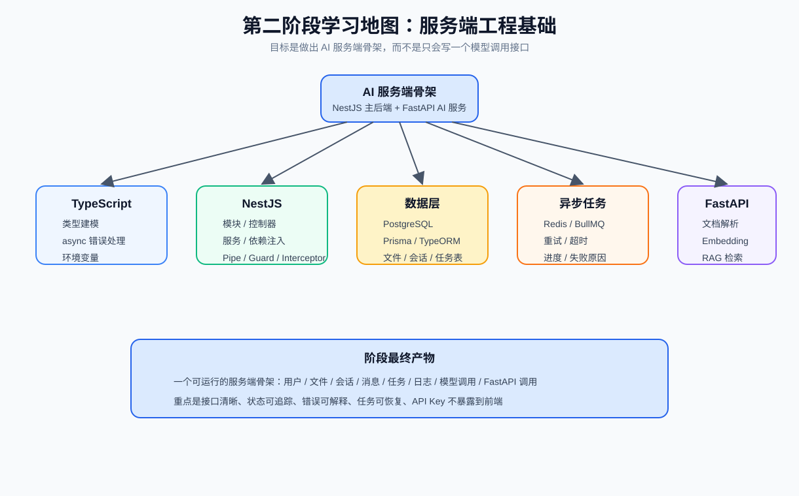
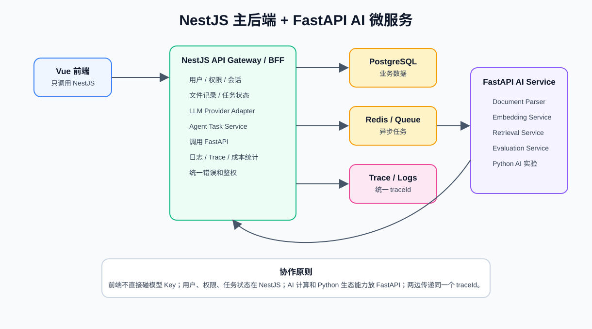
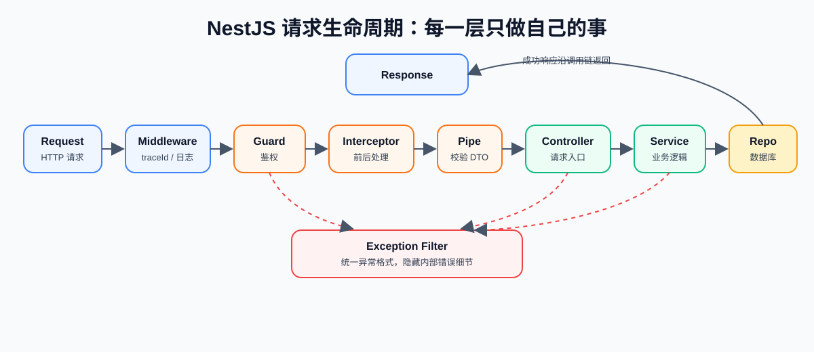
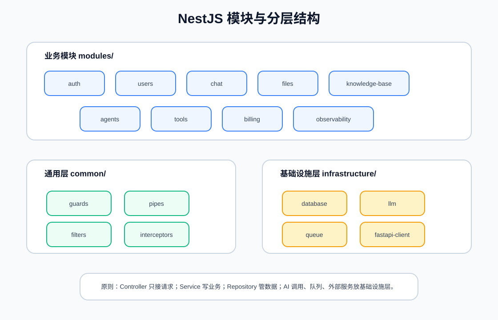
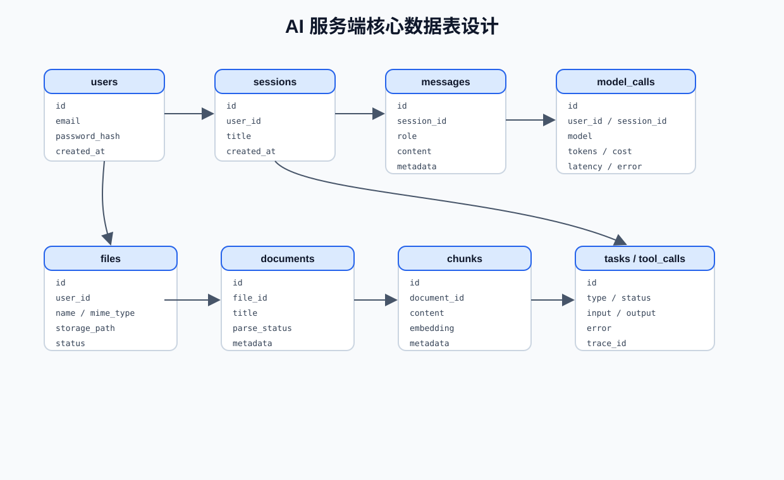
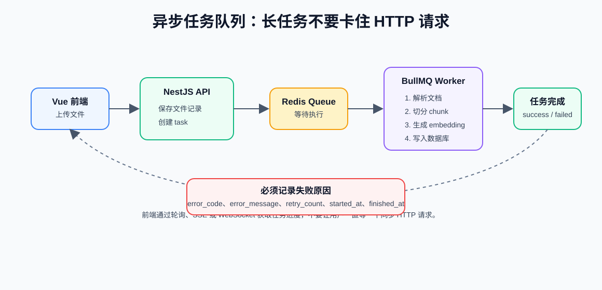
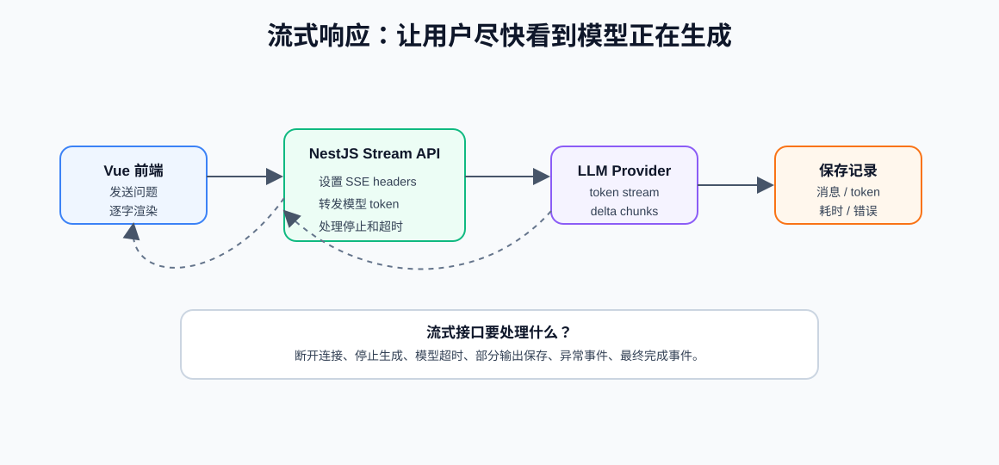

一个稳定的 AI 服务端骨架：前端不暴露 API Key，后端能管理用户、会话、文件、任务、日志、成本和错误，长任务能异步执行，Python AI 能力能通过 FastAPI 接进来。



你可以先记住这个分工：

- Vue 前端负责交互：聊天、上传、进度、错误、引用展示
- NestJS 是主后端：用户、权限、会话、文件、任务、日志、成本、对外 API
- PostgreSQL 保存业务数据：用户、会话、消息、文件、任务、调用记录
- Redis / BullMQ 处理异步任务：文档解析、embedding、长报告、Agent 多步骤执行
- FastAPI 做 AI 微服务：文档解析、embedding、RAG 检索、评估、Python AI 生态能力
- LLM Provider 层适配不同模型：OpenAI、Claude、通义千问、DeepSeek 等

相较于普通后端主要处理业务数据，`AI后端负责把不稳定的模型能力，包装成可控、可查、可恢复、可计费的产品能力`

| 能力 | 普通后端 | AI 后端 |
| --- | --- | --- |
| 鉴权 | 用户登录、接口权限 | 还要控制文档、工具、模型调用权限 |
| 日志 | 请求、SQL、异常 | 还要记录 prompt、模型、token、工具调用、trace |
| 成本 | 服务器、数据库 | 还要统计模型 token、embedding、重试成本 |
| 任务 | 普通异步任务 | 文档解析、向量入库、长报告、Agent 多步骤 |
| 安全 | 参数校验、越权 | 还要防 prompt injection、敏感信息泄露、工具误调用 |
| 测试 | 固定输入输出 | 还要做 eval、格式校验、质量回归 |


## 1. 总体架构

NestJS 主后端 + FastAPI AI 微服务 架构图如下，主要原则前端只调 NestJS；NestJS 管业务和权限；FastAPI 做 AI 计算能力；两边用 traceId 串起来


NestJS 适合做主后端，因为它：

- 天然支持模块化
- TypeScript 类型友好
- 有依赖注入和清晰分层
- 适合写 Guard、Pipe、Interceptor、Exception Filter
- 适合接 PostgreSQL、Redis、队列、鉴权、日志
- 项目结构更接近企业后端工程

FastAPI 不是替代 NestJS，而是补齐 Python AI 生态。

适合放到 FastAPI 的能力：

- PDF / Word / HTML 文档解析
- 文本切分
- Embedding 生成
- 向量检索
- RAG 质量评估
- Python Agent 框架实验
- 复杂数据处理脚本

### 两者的边界

| 能力 | 放 NestJS | 放 FastAPI |
| --- | --- | --- |
| 用户、登录、权限 | 是 | 否 |
| 会话、消息、文件记录 | 是 | 否 |
| 任务状态、调用日志、成本统计 | 是 | 可辅助 |
| 模型 Provider 适配层 | 优先 NestJS | 也可实验 |
| 文档解析、embedding、检索 | 可转发 | 是 |
| RAG 评估、复杂 AI 实验 | 可触发 | 是 |
| 对前端暴露 API | 是 | 通常否 |

## 2. TypeScript 工程化基础

AI 应用里会有大量结构化数据：消息、任务、工具参数、模型响应、RAG 片段、调用日志。TypeScript 能显著减少联调成本。

### 你必须重视类型

不要到处写 `any`。AI 输出已经够不稳定了，业务代码不能再失控。

示例：聊天消息类型。

```ts
type ChatRole = "system" | "user" | "assistant" | "tool";

type ChatMessage = {
  id: string;
  sessionId: string;
  role: ChatRole;
  content: string;
  metadata?: Record<string, unknown>;
  createdAt: string;
};
```

示例：异步任务类型。

```ts
type TaskStatus = "pending" | "running" | "success" | "failed" | "cancelled";

type AgentTask = {
  id: string;
  type: "document_index" | "agent_run" | "report_generate";
  status: TaskStatus;
  progress: number;
  input: Record<string, unknown>;
  output?: Record<string, unknown>;
  errorMessage?: string;
  createdAt: string;
  updatedAt: string;
};
```

### DTO 思维

DTO 是 Data Transfer Object，用来定义接口输入输出。例如创建聊天请求：

```ts
type CreateChatRequest = {
  sessionId?: string;
  message: string;
  model?: string;
};

type CreateChatResponse = {
  sessionId: string;
  messageId: string;
  answer: string;
  usage?: {
    inputTokens: number;
    outputTokens: number;
    estimatedCost: number;
  };
};
```

你要养成习惯：

- 前端发什么，用 DTO 定义
- 后端返回什么，用 DTO 定义
- 模型输出什么，用 schema 定义
- 工具参数是什么，用 schema 定义

### async/await 错误处理

AI 后端常见失败：

- 模型接口超时
- 模型限流
- JSON 解析失败
- FastAPI 服务不可用
- 文件解析失败
- 队列任务失败
- 数据库写入失败

不要吞掉错误。至少要记录：

```text
traceId
userId
接口名
任务 ID
外部服务名
错误类型
错误消息
耗时
```

## 3. NestJS 核心概念

NestJS 的价值在于让后端结构清晰。先把每一层的职责理解清楚。



### Module

Module 是模块边界。一个业务域通常一个模块。示例：

```text
AuthModule
UsersModule
ChatModule
FilesModule
KnowledgeBaseModule
AgentsModule
ToolsModule
BillingModule
```

模块的作用：

- 组织 Controller 和 Service
- 管理依赖注入
- 暴露可复用 Provider
- 降低业务耦合

### Controller

Controller 负责 HTTP 请求入口。

它应该做：

- 接收请求参数
- 调用 Service
- 返回响应

它不应该做：

- 复杂业务逻辑
- 直接写 SQL
- 直接拼 prompt
- 直接执行 Agent 工作流

错误写法：

```ts
// Controller 里写满业务逻辑、数据库、模型调用，会很快失控
```

正确思路：

```ts
// Controller 只接请求
// ChatService 处理会话和模型调用
// LlmService 封装模型 Provider
// MessageRepository 保存消息
```

### Service 和 Provider

Service 是业务逻辑层。Provider 是能被依赖注入管理的对象，Service 通常就是 Provider。

AI 项目里的常见 Service：

- `ChatService`：处理聊天、会话、消息保存
- `LlmService`：统一模型调用
- `FileService`：处理文件上传和文件记录
- `KnowledgeBaseService`：触发文档索引任务
- `AgentTaskService`：创建和推进 Agent 任务
- `CostService`：统计 token 和费用
- `TraceService`：记录 trace 和调用日志

### Dependency Injection

依赖注入让你不用在业务代码里手动 new 各种对象。

它的好处：

- 方便测试
- 方便替换实现
- 方便统一管理生命周期
- 让模块依赖更清楚

例如未来你可能从 OpenAI 切到其他模型，只要替换 `LlmProvider` 实现，而不是全项目搜索修改。

### Pipe、Guard、Interceptor、Exception Filter

| 组件 | 作用 | AI 项目里的例子 |
| --- | --- | --- |
| Pipe | 参数转换和校验 | 检查 message 不能为空、fileId 格式正确 |
| Guard | 鉴权和权限判断 | 判断用户是否登录、是否能访问某个文档 |
| Interceptor | 请求前后处理 | 记录耗时、traceId、统一响应格式 |
| Exception Filter | 统一异常输出 | 把模型超时、队列失败转成标准错误 |

这四个东西是 NestJS 工程化的核心。面试里很常问。

## 4. 目录结构

用模块化目录，而不是把文件都扔进 `controllers/` 和 `services/`。



推荐结构：

```text
src/
  main.ts
  app.module.ts
  modules/
    auth/
      auth.controller.ts
      auth.service.ts
      auth.module.ts
    users/
    chat/
    files/
    knowledge-base/
    agents/
    tools/
    billing/
    observability/
  common/
    guards/
    pipes/
    filters/
    interceptors/
    decorators/
  infrastructure/
    database/
    llm/
    queue/
    storage/
    fastapi-client/
  config/
```

### 分层原则

| 层 | 职责 |
| --- | --- |
| Controller | 请求入口，只处理 HTTP 层 |
| Service | 业务逻辑，编排 repository、LLM、queue |
| Repository | 数据库读写 |
| Infrastructure | 外部系统适配，如 LLM、队列、文件存储、FastAPI |
| Common | 通用 Guard、Pipe、Filter、Interceptor |

核心原则：

```text
Controller 薄，Service 清楚，Repository 专注数据，外部依赖放 infrastructure。
```

## 5. API 设计

AI 服务端最常见的 API 包括聊天、文件、知识库、任务、日志。

### 基础接口清单

| 接口 | 作用 |
| --- | --- |
| `POST /api/chat` | 普通非流式聊天 |
| `GET /api/chat/stream` 或 `POST /api/chat/stream` | 流式聊天 |
| `GET /api/sessions` | 查询会话列表 |
| `GET /api/sessions/:id/messages` | 查询会话消息 |
| `POST /api/files/upload` | 上传文件 |
| `POST /api/knowledge-base/index` | 触发文档索引 |
| `GET /api/tasks/:id` | 查询任务状态 |
| `POST /api/agent/run` | 启动 Agent 任务 |
| `GET /api/model-calls` | 查询模型调用日志 |

### 统一响应格式

建议统一格式：

```json
{
  "success": true,
  "data": {},
  "traceId": "trace_abc123"
}
```

错误格式：

```json
{
  "success": false,
  "error": {
    "code": "MODEL_TIMEOUT",
    "message": "模型服务响应超时，请稍后重试"
  },
  "traceId": "trace_abc123"
}
```

为什么要有 `traceId`：

- 用户截图反馈时可以定位问题
- 前后端日志能串起来
- NestJS 和 FastAPI 调用能串起来
- Agent 多步骤任务能串起来

### 接口设计原则

- 用户身份从 token/session 里取，不要让前端传 `userId`
- 文件上传后先保存文件记录，再异步解析
- 长任务返回 `taskId`，不要让 HTTP 一直等待
- 所有模型调用都要记录 usage、latency、model、error
- 所有工具调用都要记录 input、output、status、traceId
- 对外错误消息要友好，内部错误细节写日志

## 6. 数据库设计基础

AI 应用不是只有“消息表”。只要你想做成产品，就必须能保存会话、文件、任务、调用记录、工具记录。



### 推荐核心表

| 表 | 作用 |
| --- | --- |
| `users` | 用户 |
| `sessions` | 聊天会话 |
| `messages` | 消息记录 |
| `files` | 上传文件记录 |
| `documents` | 解析后的文档 |
| `chunks` | 文档切分片段，后续可带 embedding |
| `tasks` | 异步任务状态 |
| `model_calls` | 模型调用日志和成本 |
| `tool_calls` | 工具调用审计 |

### 聊天记录怎么设计

最小结构：

```text
sessions
  id
  user_id
  title
  created_at
  updated_at

messages
  id
  session_id
  role
  content
  metadata
  created_at
```

`role` 通常包括：

- `system`
- `user`
- `assistant`
- `tool`

`metadata` 可以保存：

- model
- token usage
- retrieved chunk ids
- tool call ids
- error info

### 文件和文档怎么设计

文件上传后，不要只保存一个路径。建议区分 `files` 和 `documents`：

```text
files：原始文件记录
documents：解析后的文档记录
chunks：文档切分片段
```

这样做的好处：

- 原始文件和解析结果分离
- 解析失败可以重试
- 同一个文件可以有多个解析版本
- chunk 可以独立评估和检索

### 模型调用日志怎么设计

`model_calls` 至少记录：

```text
id
trace_id
user_id
session_id
provider
model
input_tokens
output_tokens
estimated_cost
latency_ms
status
error_code
created_at
```

不要默认把完整 prompt 全量保存到数据库，尤其是可能包含隐私和敏感信息时。可以保存摘要、hash、脱敏版本或仅在开发环境保存。

## 7. PostgreSQL、Prisma 和迁移

PostgreSQL 的优势：

- 稳定成熟
- 适合复杂业务数据
- 支持 JSONB
- 可以接 pgvector 做向量检索
- 部署和云服务选择多

ORM常见选择：

- Prisma：类型友好，上手清晰，适合 TypeScript 学习和作品集
- TypeORM：NestJS 生态常见，传统企业项目里也常见
- Drizzle：轻量，类型强，但学习资料相对少一些

不要手动在数据库里点来点去建表。真实项目要有迁移文件。

- schema 是数据库结构的代码化描述
- migration 是数据库结构变化记录
- 不同环境通过 migration 保持结构一致
- 回滚和变更要谨慎

## 8. 队列和异步任务

AI 应用里很多任务不能同步等待


任务表`tasks` 至少记录：

```text
id
user_id
type
status
progress
input
output
error_code
error_message
retry_count
started_at
finished_at
created_at
updated_at
```

常见任务状态：

| 状态 | 含义 |
| --- | --- |
| `pending` | 已创建，等待执行 |
| `running` | 正在执行 |
| `success` | 执行成功 |
| `failed` | 执行失败 |
| `cancelled` | 用户取消 |

Worker 不是写完就行，还要考虑：

- 最大重试次数
- 失败原因记录
- 幂等：同一个任务重复执行不会造成重复脏数据
- 超时控制
- 进度更新
- 并发数量
- 任务取消
- 死信或人工排查

## 9. FastAPI AI 微服务

FastAPI 负责更贴近 Python AI 生态的能力。它通常不直接暴露给前端，而是由 NestJS 调用。

### 推荐接口

| 接口 | 作用 |
| --- | --- |
| `POST /parse` | 解析文档文本 |
| `POST /chunk` | 文本切分 |
| `POST /embed` | 生成 embedding |
| `POST /retrieve` | 检索相关 chunk |
| `POST /evaluate/rag` | RAG 质量评估 |

### Pydantic 模型

FastAPI 常用 Pydantic 定义请求和响应。

示例：

```py
from pydantic import BaseModel

class EmbedRequest(BaseModel):
    texts: list[str]

class EmbedResponse(BaseModel):
    vectors: list[list[float]]
```

这和 TypeScript DTO 思维类似：接口输入输出都要结构化。

### NestJS 调 FastAPI 时要注意什么

- 传递 `traceId`
- 设置超时时间
- 对失败做错误映射
- 不要把 FastAPI 内部错误直接返回用户
- 记录 latency
- 明确请求和响应 schema

示例错误映射：

```text
FastAPI 解析 PDF 失败
  -> NestJS 记录原始错误
  -> 返回 FILE_PARSE_FAILED
  -> 前端展示：文件解析失败，请换一个文件或稍后重试
```

## 10. LLM Provider 适配层

建立 Provider 层。不要让业务代码直接写：

```ts
// 到处直接调用某个厂商 SDK
```

应该封装成统一接口：

```ts
type LlmMessage = {
  role: "system" | "user" | "assistant" | "tool";
  content: string;
};

type LlmGenerateOptions = {
  model: string;
  messages: LlmMessage[];
  temperature?: number;
  traceId: string;
};

type LlmGenerateResult = {
  content: string;
  inputTokens?: number;
  outputTokens?: number;
  latencyMs: number;
};

interface LlmProvider {
  generate(options: LlmGenerateOptions): Promise<LlmGenerateResult>;
  stream?(options: LlmGenerateOptions): AsyncIterable<string>;
}
```

这样后面你换模型时，业务层不用大改。

## 11. 流式响应

AI 产品体验很依赖流式输出。用户不想等 20 秒后才看到完整答案。



### SSE 和 WebSocket 怎么选

| 方案 | 适合场景 |
| --- | --- |
| SSE | 服务端持续向前端推送文本，聊天流式输出很适合 |
| WebSocket | 双向实时通信，如协作编辑、多路事件、复杂实时状态 |
| 普通 HTTP | 短任务、非流式接口 |


### 流式接口要处理的问题

- 设置正确响应头
- 边接收模型 token，边推给前端
- 用户断开连接时停止下游调用
- 用户点击停止生成时中断
- 模型超时时返回错误事件
- 部分输出是否保存
- 最终完成时记录 usage 和耗时

## 12. 日志、Trace 和成本统计

AI 应用没有日志，很难排查。

普通请求日志至少记录：

- traceId
- userId
- method
- path
- statusCode
- latencyMs
- errorCode

模型调用日志至少记录：

- provider
- model
- inputTokens
- outputTokens
- estimatedCost
- latencyMs
- status
- errorCode

工具调用日志至少记录：

- toolName
- input
- output 摘要
- status
- latencyMs
- errorCode
- traceId

成本统计不是最后才做。你从第一个模型接口就应该记录 token。

最小成本公式：

```text
estimatedCost =
  inputTokens * inputPricePerToken
  + outputTokens * outputPricePerToken
```

不同模型价格不同，所以价格表不要写死在业务逻辑里。

## 13. 统一错误处理

AI 应用错误很多，必须分类。

### 常见错误码

| 错误码 | 含义 |
| --- | --- |
| `VALIDATION_ERROR` | 请求参数不合法 |
| `UNAUTHORIZED` | 未登录 |
| `FORBIDDEN` | 无权限 |
| `MODEL_TIMEOUT` | 模型超时 |
| `MODEL_RATE_LIMITED` | 模型限流 |
| `MODEL_BAD_OUTPUT` | 模型输出格式错误 |
| `FILE_TOO_LARGE` | 文件太大 |
| `FILE_PARSE_FAILED` | 文件解析失败 |
| `TASK_FAILED` | 异步任务失败 |
| `FASTAPI_UNAVAILABLE` | AI 微服务不可用 |

### 错误消息原则

对用户：

```text
文件解析失败，请换一个文件或稍后重试。
```

对日志：

```text
traceId=xxx, fileId=xxx, parser=pdf, error=Cannot read xref table...
```

不要把内部堆栈、密钥、完整 prompt 直接返回前端。

## 参考资料

- NestJS Controllers：https://docs.nestjs.com/controllers
- NestJS Providers：https://docs.nestjs.com/providers
- NestJS Modules：https://docs.nestjs.com/modules
- NestJS Request Lifecycle：https://docs.nestjs.com/faq/request-lifecycle
- NestJS Guards：https://docs.nestjs.com/guards
- NestJS Pipes：https://docs.nestjs.com/pipes
- NestJS Interceptors：https://docs.nestjs.com/interceptors
- NestJS Exception Filters：https://docs.nestjs.com/exception-filters
- FastAPI Background Tasks：https://fastapi.tiangolo.com/tutorial/background-tasks/
- FastAPI Upload Files：https://fastapi.tiangolo.com/tutorial/request-files/
- Prisma PostgreSQL 文档：https://www.prisma.io/docs/orm/overview/databases/postgresql
- BullMQ 文档：https://docs.bullmq.io/
