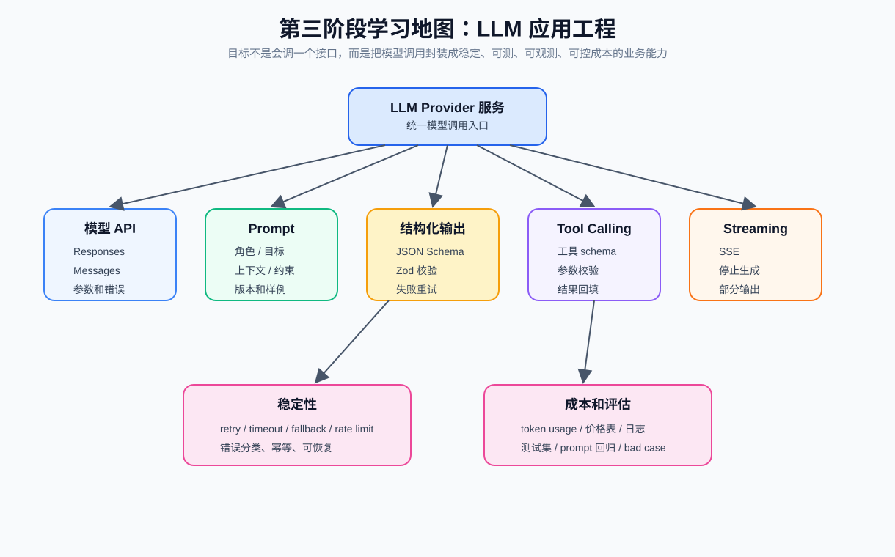
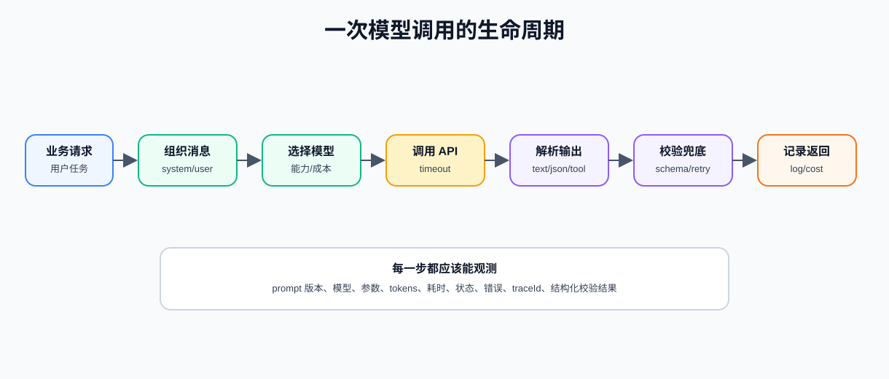
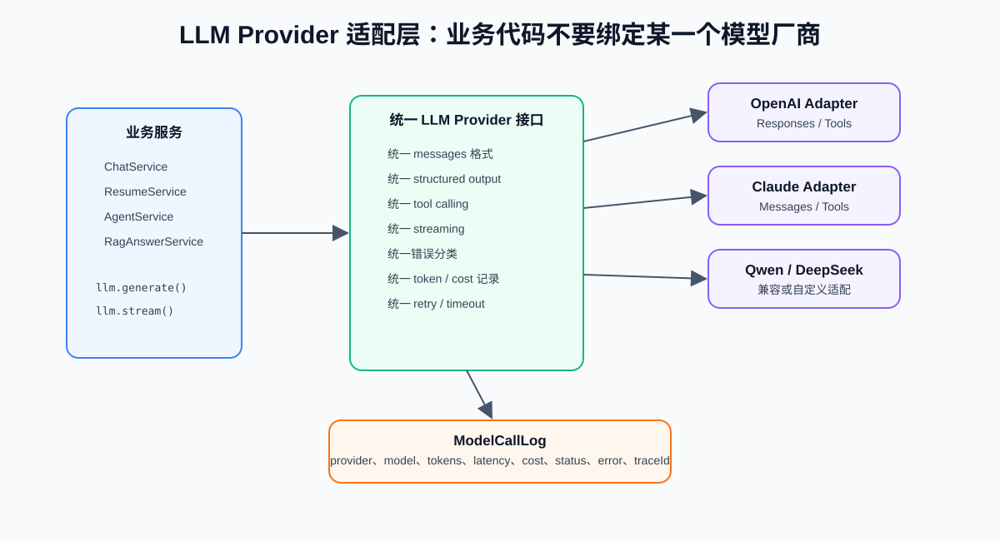
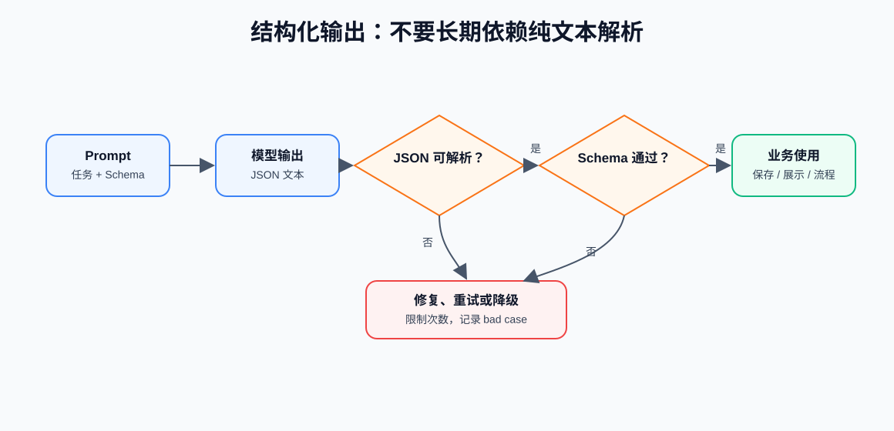
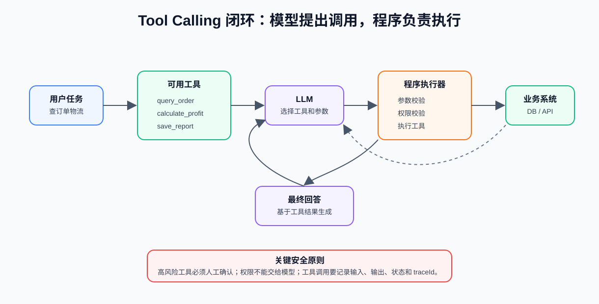
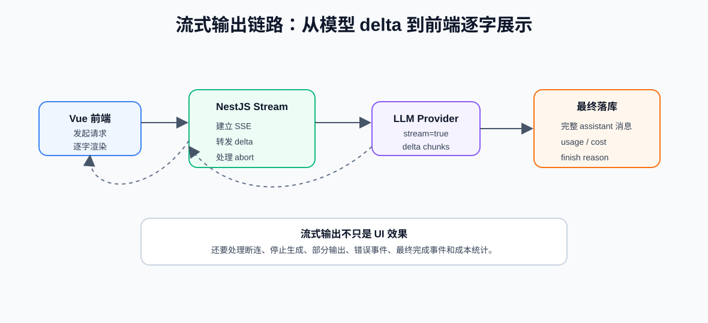
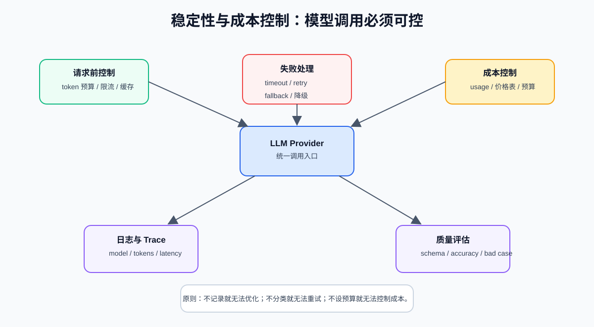
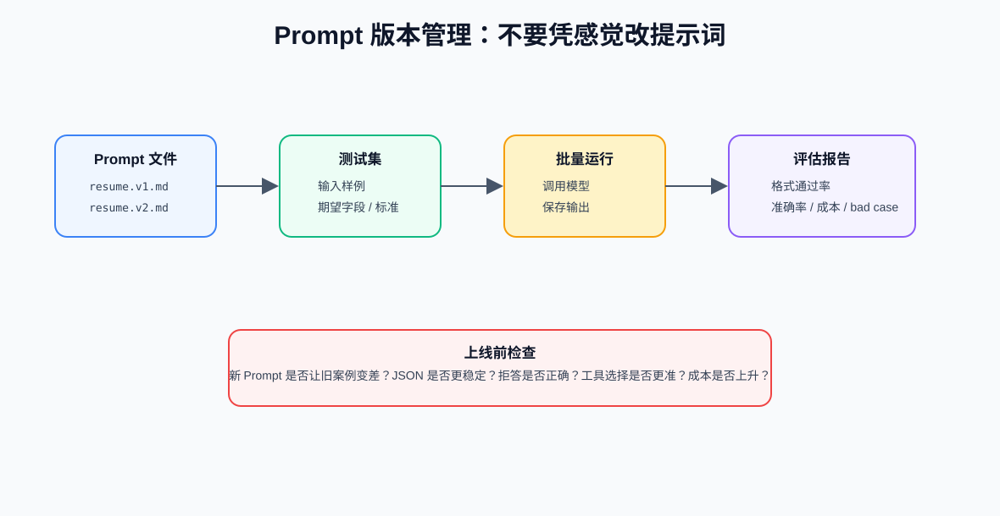

现在我们需要能做到：

- 理解主流 LLM API 的共同抽象：messages、model、temperature、stream、tools、response format
- 设计统一的 `LlmProvider` 接口，避免业务代码绑定某一个模型厂商
- 写出可维护的 prompt：角色、任务、上下文、约束、输出格式、示例
- 使用 JSON Schema / Zod 思维做结构化输出和校验
- 理解 Function Calling / Tool Calling 的完整闭环
- 实现流式输出的后端链路和前端消费思路
- 处理 timeout、retry、rate limit、fallback、bad output 等失败场景
- 记录模型调用日志、token usage、耗时、成本和 traceId
- 设计 prompt 版本管理和小型回归测试集

核心产物是一个统一的 LLM Provider 服务



你可以先把 LLM 应用工程拆成 7 件事：

- 模型 API：知道怎么调用模型，怎么传 messages、参数、工具和流式选项
- Provider 适配层：统一 OpenAI、Claude、DeepSeek、通义千问等不同厂商
- Prompt 设计：把任务说明写成可维护的模板
- 结构化输出：让模型返回可被程序使用的 JSON，而不是只返回自然语言
- Tool Calling：让模型请求调用外部工具，再由程序执行
- Streaming：把模型生成过程实时推给前端
- 稳定性和成本：重试、超时、降级、限流、token 统计和评估

## 1. 模型 API 的基本形态

不同厂商 API 名字和字段可能不同，但大体抽象相似。

一次模型请求通常包含：

| 字段 | 作用 |
| --- | --- |
| `model` | 使用哪个模型 |
| `messages` 或 `input` | 用户问题、系统指令、历史消息、工具结果 |
| `temperature` | 控制随机性 |
| `max_tokens` 或类似参数 | 控制最大输出长度 |
| `stream` | 是否流式返回 |
| `tools` | 可用工具定义 |
| `response_format` / schema | 结构化输出约束 |

一次模型响应通常包含：

| 字段 | 作用 |
| --- | --- |
| 输出文本 | 模型生成的自然语言 |
| 结构化 JSON | 模型按 schema 返回的对象 |
| tool call | 模型请求调用的工具和参数 |
| usage | 输入 token、输出 token |
| finish reason | 为什么结束，如正常结束、长度达到上限、工具调用等 |

模型交互有不同说法，例如：

- OpenAI 现在推荐使用 Responses API 作为更统一的模型交互接口
- Chat Completions 是经典聊天接口，很多教程和兼容模型仍然使用
- Claude 等模型常用 Messages API 的叫法
- 很多国内模型提供 OpenAI-compatible 接口，字段类似 Chat Completions

共同点是：

```text
模型输入 = 指令 + 用户问题 + 上下文 + 可选工具
模型输出 = 文本 / JSON / 工具调用请求 / token usage
```

### 一次模型调用的生命周期



你在代码里要把一次模型调用当成完整业务链路，而不是一行 SDK 调用。完整流程：

```text
业务服务收到请求
  -> 组织 system / user / context messages
  -> 选择模型和参数
  -> 调用 LLM Provider
  -> 解析模型输出
  -> 校验结构或工具参数
  -> 失败时重试或兜底
  -> 记录 usage、cost、latency、traceId
  -> 返回业务结果
```

## 2. LLM Provider 适配层

不要让业务代码直接依赖某个模型 SDK，这样后面换模型、加日志、加重试、统计成本都会变得很痛苦。正确方向是做统一适配层：



### 统一接口设计

可以先设计一个最小 TypeScript 接口：

```ts
type LlmRole = "system" | "user" | "assistant" | "tool";

type LlmMessage = {
  role: LlmRole;
  content: string;
  name?: string;
  toolCallId?: string;
};

type LlmGenerateOptions = {
  traceId: string;
  model: string;
  messages: LlmMessage[];
  temperature?: number;
  maxTokens?: number;
  responseSchema?: unknown;
  tools?: LlmTool[];
};

type LlmUsage = {
  inputTokens: number;
  outputTokens: number;
  estimatedCost?: number;
};

type LlmGenerateResult = {
  type: "text" | "json" | "tool_call";
  content?: string;
  data?: unknown;
  toolCalls?: LlmToolCall[];
  usage?: LlmUsage;
  latencyMs: number;
  raw?: unknown;
};

interface LlmProvider {
  generate(options: LlmGenerateOptions): Promise<LlmGenerateResult>;
  stream?(options: LlmGenerateOptions): AsyncIterable<string>;
}
```

Provider 层应该统一如下东西：

- messages 格式
- 模型参数
- 结构化输出
- 工具定义和工具调用结果
- 流式输出事件
- 错误分类
- token usage
- latency
- traceId
- 成本估算
- retry / timeout / fallback

## 3. Messages 和上下文组织

模型能不能答好，很多时候不只是模型能力，而是你给它看的上下文是否清楚。常见消息角色

| 角色 | 作用 |
| --- | --- |
| system | 应用规则、身份、边界 |
| user | 用户当前任务 |
| assistant | 模型历史回复 |
| tool | 工具调用结果 |

示例：

```ts
const messages = [
  {
    role: "system",
    content: "你是一个严谨的简历优化助手，必须基于用户提供的信息回答。"
  },
  {
    role: "user",
    content: "这是我的简历和目标岗位，请分析匹配度..."
  }
];
```

### System Prompt 不要写太虚

弱 system prompt：`你是一个智能助手。`

更好的 system prompt：

```text
你是一个严谨的简历优化助手。

规则：
1. 只能基于用户提供的简历和岗位描述分析
2. 不要编造不存在的经历
3. 输出必须符合给定 JSON Schema
4. 不确定的内容放入 missingInfo 字段
5. 不输出与求职无关的建议
```

### 上下文不要无限堆

常见错误：`把所有历史消息、所有文档、所有工具结果都塞给模型。`

正确方向：

- 最近几轮对话保留
- 旧对话做摘要
- RAG 只放最相关 chunk
- 工具结果只放必要字段
- 对输出预留 token 空间
- 超长输入先压缩或分批处理

## 4. Prompt 工程

Prompt 不是玄学，是任务说明书。你要把 prompt 写成可维护、可测试、可版本管理的工程资产。一个好 Prompt 的结构

```text
角色：
你是谁？

任务：
你要完成什么？

输入：
用户会提供哪些信息？

上下文：
有哪些背景材料、检索片段、工具结果？

约束：
不能做什么？必须做什么？

输出格式：
返回 Markdown、JSON、表格，还是工具调用？

质量标准：
什么叫好答案？什么情况下要拒答？

示例：
给一两个正确样例，必要时给反例。
```

### Prompt 模板示例

```text
你是一个严谨的简历优化助手。

任务：
根据用户简历和目标岗位，分析匹配度、技能缺口，并给出项目经历改写建议。

输入：
简历：
{{resume}}

目标岗位：
{{jobDescription}}

要求：
1. 不要编造用户没有写过的经历
2. 如果信息不足，把问题写入 missingInfo
3. 输出必须是 JSON
4. 每条建议必须能对应到简历或岗位描述中的依据

输出字段：
- matchScore: number，0 到 100
- strengths: string[]
- gaps: string[]
- rewriteSuggestions: { original: string; improved: string; reason: string }[]
- missingInfo: string[]
```

Prompt 常见错误

| 错误 | 后果 |
| --- | --- |
| 只写“帮我分析一下” | 输出发散，不稳定 |
| 没有定义输出格式 | 前端和后端难处理 |
| 没有拒答规则 | 模型容易编造 |
| 把业务规则藏在用户输入里 | 容易被用户覆盖 |
| prompt 太长且无结构 | 模型忽略关键约束 |
| 没有测试样例 | 修改后不知道变好还是变坏 |

## 5. 结构化输出

真实 AI 产品不能长期依赖自然语言解析。只要模型输出要进入系统，就应该尽量结构化。



自然语言适合给人看，结构化 JSON 适合给程序用，结构化输出适合：

- 简历分析
- 商品分析报告
- 合同风险条款
- 客服质检标签
- Agent 下一步动作
- RAG 引用列表
- 任务计划步骤

### TypeScript 类型先行

先定义业务需要什么结构：

```ts
type ResumeAnalysis = {
  matchScore: number;
  strengths: string[];
  gaps: string[];
  rewriteSuggestions: Array<{
    original: string;
    improved: string;
    reason: string;
  }>;
  missingInfo: string[];
};
```

再转成 JSON Schema 或 Zod schema 做校验。

### Zod 校验思路

```ts
import { z } from "zod";

const ResumeAnalysisSchema = z.object({
  matchScore: z.number().min(0).max(100),
  strengths: z.array(z.string()),
  gaps: z.array(z.string()),
  rewriteSuggestions: z.array(
    z.object({
      original: z.string(),
      improved: z.string(),
      reason: z.string()
    })
  ),
  missingInfo: z.array(z.string())
});
```

拿到模型输出后：

```ts
const parsed = ResumeAnalysisSchema.safeParse(modelOutput);

if (!parsed.success) {
  // 记录错误，尝试修复或重试
}
```

结构化输出常见失败：

- 返回了 Markdown 包裹的 JSON
- 缺字段
- 字段类型错
- 数字范围不对
- 输出了额外解释
- 数组里混入非字符串

处理顺序：

1. 优先用 API 原生结构化输出能力
2. 用 schema 校验
3. 失败时让模型修复一次
4. 仍失败就重试或降级
5. 记录 bad case
6. 不要无限重试

## 6. Function Calling / Tool Calling

Function Calling 和 Tool Calling 的核心思想是：模型根据任务选择工具和参数，程序负责校验和执行工具。



### 工具调用完整流程

```text
用户提出任务
  -> 后端把可用工具 schema 提供给模型
  -> 模型决定调用哪个工具，生成参数
  -> 后端校验参数
  -> 后端校验权限
  -> 后端执行工具
  -> 后端把工具结果作为 tool message 回填给模型
  -> 模型基于工具结果生成最终回答
  -> 后端记录工具调用日志
```

### 工具定义示例

```ts
type LlmTool = {
  name: string;
  description: string;
  parameters: unknown;
};

const queryOrderTool: LlmTool = {
  name: "query_order",
  description: "查询当前用户有权限访问的订单状态和物流信息。",
  parameters: {
    type: "object",
    properties: {
      orderId: {
        type: "string",
        description: "订单 ID，例如 1001"
      }
    },
    required: ["orderId"]
  }
};
```

### 工具 description 怎么写

工具 description 不是给人看的文档，而是给模型判断“什么时候该用这个工具”的依据。

差的写法：

```text
查询订单。
```

更好的写法：

```text
当用户想查询订单状态、物流进度、发货信息时使用。
只能查询当前登录用户有权限访问的订单。
不要用于退款、修改地址或取消订单。
```

### 工具调用的安全边界

必须牢记：

```text
模型只提出调用意图。
程序负责校验、鉴权、执行和审计。
```

高风险工具包括：

- 删除文件
- 退款
- 发邮件或短信
- 修改数据库
- 下单
- 公开发布内容

这些工具必须人工确认。

### 工具失败怎么办

工具失败时，不要让模型自己猜。

应该把明确错误返回给模型或用户：

```json
{
  "error": {
    "code": "ORDER_NOT_FOUND",
    "message": "没有找到该订单，或你没有权限访问"
  }
}
```

并记录：

- toolName
- args
- userId
- traceId
- status
- latencyMs
- errorCode

## 7. 流式输出

流式输出让用户尽快看到模型正在生成，而不是等完整答案返回。



### 流式输出的基本链路

```text
前端发起聊天请求
  -> NestJS 调用 LLM Provider stream
  -> 模型持续返回 delta
  -> NestJS 通过 SSE 推给前端
  -> 前端逐字渲染
  -> 生成结束后保存完整 assistant message
  -> 记录 usage、cost、finish reason
```

### 流式输出要处理什么

- 用户断开连接
- 用户点击停止生成
- 模型超时
- 模型返回错误事件
- 部分输出是否保存
- 最终 usage 如何记录
- 前端如何处理换行、代码块、Markdown
- 重试时是否会重复保存消息

### SSE 事件设计

可以设计成：

```text
event: delta
data: {"text":"你好"}

event: delta
data: {"text":"，我是"}

event: error
data: {"code":"MODEL_TIMEOUT","message":"模型响应超时"}

event: done
data: {"messageId":"msg_123","usage":{"inputTokens":100,"outputTokens":20}}
```

前端按事件类型处理，而不是把所有东西都当成纯文本。

## 8. 错误处理、重试和 Fallback

模型调用失败很常见，所以必须分类处理。



常见模型调用错误类型

| 错误 | 说明 | 处理 |
| --- | --- | --- |
| timeout | 模型响应超时 | 可重试或提示稍后再试 |
| rate limit | 触发限流 | 等待后重试、排队或降级 |
| bad output | 输出格式不符合 schema | 修复、重试、记录 bad case |
| context length | 上下文过长 | 压缩上下文、减少历史或 chunk |
| provider error | 模型供应商异常 | fallback 到备用模型 |
| network error | 网络错误 | 有限重试 |
| safety refusal | 模型拒答 | 展示拒答原因或调整任务 |

### 重试不是万能

适合重试：

- 网络抖动
- 429 限流，等待后重试
- 5xx 服务端错误
- 结构化输出偶发格式错误

不适合盲目重试：

- prompt 本身写错
- schema 设计不合理
- 用户输入违法违规
- 上下文超过限制
- 权限不足

### Fallback 模型

Fallback 是指主模型失败时切换备用模型。

例子：

```text
主模型：效果好，成本高
备用模型：速度快，成本低
```

注意：

- fallback 模型能力可能不同
- 输出质量可能变化
- tool calling 和 structured output 支持程度可能不同
- 日志里要记录是否发生 fallback

## 9. 成本控制

模型调用是按 token 或请求计费的。成本控制要记录 usage

每次调用至少记录：

```text
provider
model
inputTokens
outputTokens
estimatedCost
latencyMs
status
traceId
```

### 降低成本的方法

- 缩短 system prompt
- 压缩历史消息
- RAG 只放相关 chunk
- 对重复请求做缓存
- 简单任务使用便宜模型
- 复杂任务使用强模型
- 结构化输出减少反复追问
- 限制最大输出长度
- 失败重试设置上限

### 模型选择策略

不要只问“哪个模型最强”，而要按任务选择：

| 任务 | 模型选择思路 |
| --- | --- |
| 简单分类、标签 | 便宜快速模型 |
| 结构化信息抽取 | 稳定 JSON 输出能力强的模型 |
| 复杂推理 | 推理能力更强的模型 |
| 代码生成 | 代码能力强的模型 |
| 工具调用 Agent | tool calling 稳定、上下文能力好的模型 |
| 高价值任务 | 可以用强模型并加评估 |

## 10. Prompt 版本管理和回归测试

Prompt 一旦进入项目，就应该像代码一样管理。



### 推荐目录

```text
prompts/
  resume-analysis/
    v1.md
    v2.md
    schema.ts
    cases.json
    README.md
```

### Prompt 文件里写什么

建议包含：

- prompt 名称
- 适用场景
- 输入变量
- 输出 schema
- 版本号
- 修改说明
- 示例输入
- 示例输出
- 已知问题

### 小型测试集

至少准备 10-30 条案例：

```json
[
  {
    "id": "case_001",
    "input": {
      "resume": "三年前端经验...",
      "jobDescription": "AI 前端工程师..."
    },
    "expectations": {
      "mustMention": ["TypeScript", "Vue"],
      "mustNotInvent": ["Python 后端经验"],
      "minMatchScore": 60
    }
  }
]
```

### 回归检查什么

- JSON 是否稳定
- 字段是否完整
- 是否编造信息
- 是否正确拒答
- 工具选择是否正确
- 成本是否明显上升
- 旧案例是否变差

## 11. 敏感信息和安全

模型调用前后都要考虑安全。输入侧要注意：

- 不要把不必要的隐私信息发给模型
- 对日志做脱敏
- 控制上下文里包含的用户数据
- 用户上传文档要做权限过滤
- prompt injection 内容不能覆盖系统规则

输出侧要注意：

- 不输出 API Key、密钥、内部链接
- 不返回用户无权查看的文档内容
- 高风险建议加免责声明或人工确认
- 工具调用结果不要泄露原始敏感字段

日志里尤其要小心：

- 不要全量保存身份证、手机号、邮箱、合同全文
- 不要保存明文 API Key
- prompt 和工具结果要考虑脱敏
- 生产环境日志权限要控制

## 参考资料

- OpenAI Text Generation：https://platform.openai.com/docs/guides/text-generation
- OpenAI Responses API：https://platform.openai.com/docs/guides/responses
- OpenAI Structured Outputs：https://platform.openai.com/docs/guides/structured-outputs
- OpenAI Function Calling：https://platform.openai.com/docs/guides/function-calling
- OpenAI Streaming：https://platform.openai.com/docs/guides/streaming-responses
- OpenAI Prompt Engineering：https://platform.openai.com/docs/guides/prompt-engineering
- Anthropic Messages API：https://docs.anthropic.com/en/api/messages
- Google Gemini API 文档：https://ai.google.dev/gemini-api/docs
