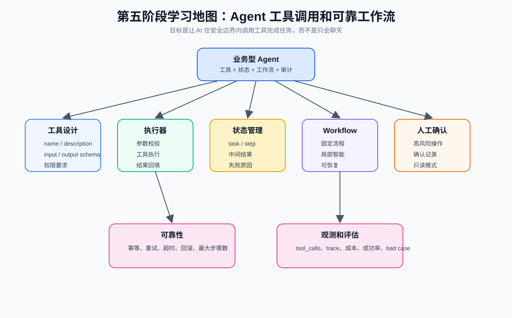
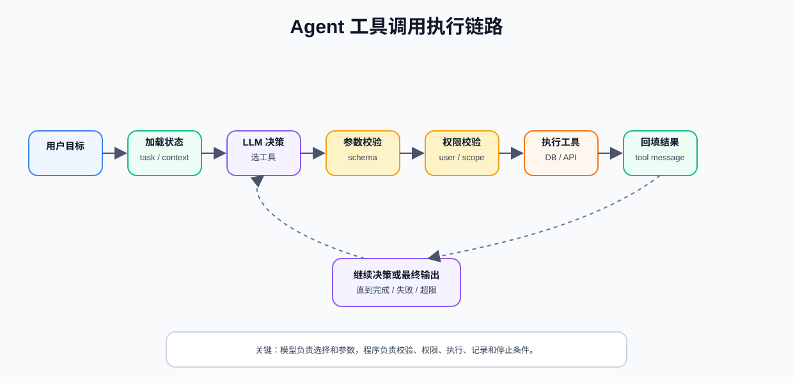
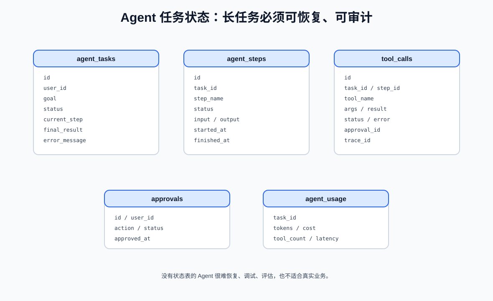
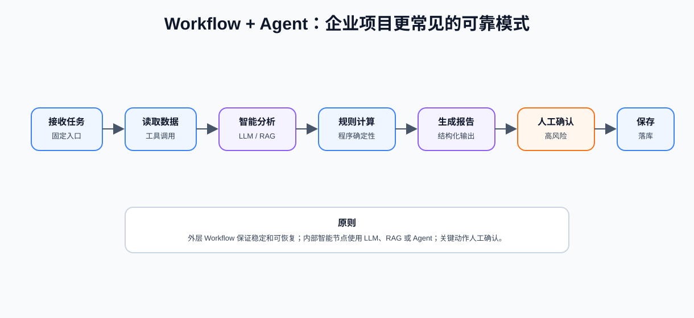
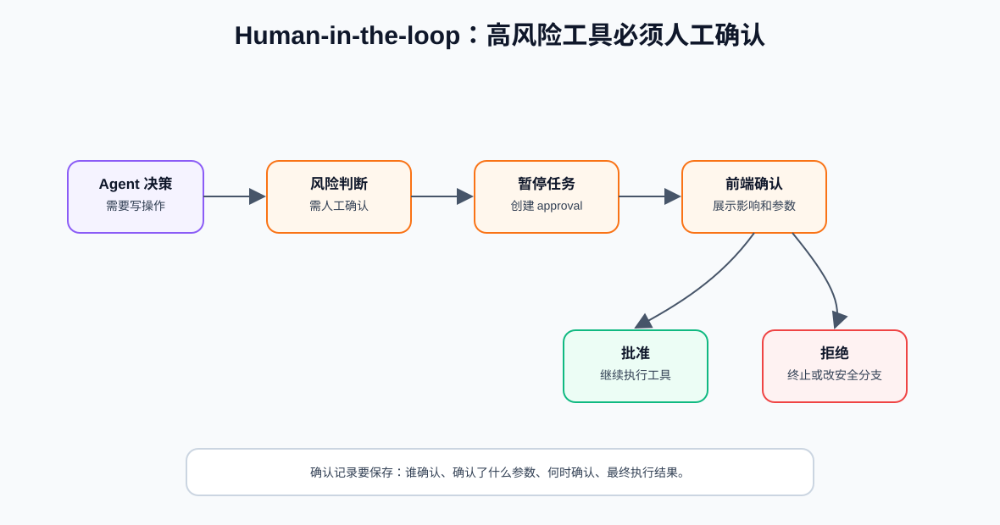
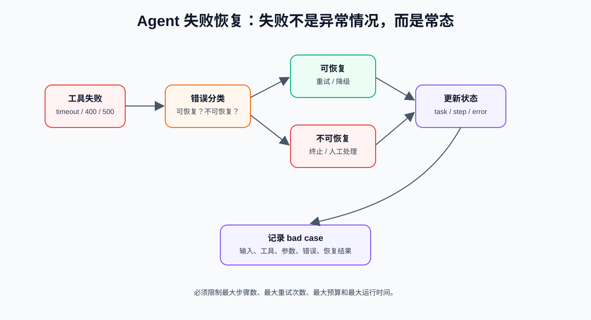
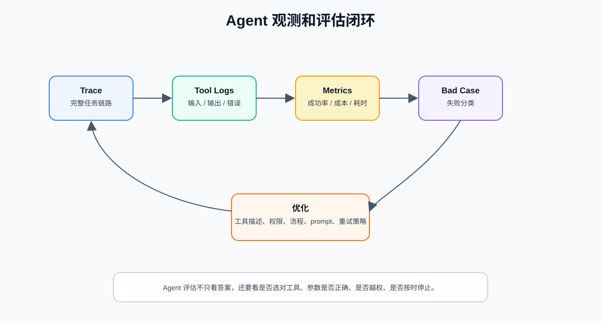

现在需要把 AI 从“问答系统”升级成“任务执行系统”；Agent 工具调用不是“让模型随便做事”，而是让模型在程序设定的工具、权限、状态和流程里完成任务。



## 1. Agent、Tool Calling 和 Workflow 的关系

先把三个概念分清楚。

| 概念 | 核心 | 适合场景 |
| --- | --- | --- |
| Tool Calling | 模型请求调用工具，程序执行 | 查询订单、计算利润、读取知识库 |
| Workflow | 程序控制固定流程，模型处理部分节点 | 合同审核、选品分析、报告生成 |
| Agent | 围绕目标动态决策，多轮调用工具推进任务 | 本地效率助手、复杂研究、开放任务 |

实际项目里常见的不是纯 Agent，而是：

```text
Workflow + Tool Calling + 局部 Agent
```

外层流程固定，保证稳定和可恢复；内部某些步骤用模型分析、工具调用或 Agent 决策。

## 2. 工具设计 Tool Schema

工具就是 Agent 能调用的能力。工具设计得越清楚，模型越容易正确选择和使用。一个工具需要包含

| 字段 | 作用 |
| --- | --- |
| `name` | 工具名，简洁明确 |
| `description` | 告诉模型什么时候用、什么时候不用 |
| `inputSchema` | 输入参数结构 |
| `outputSchema` | 输出结果结构 |
| `permission` | 调用所需权限 |
| `riskLevel` | 风险等级 |
| `timeoutMs` | 超时时间 |
| `retryPolicy` | 是否允许重试 |
| `errorCodes` | 可能错误 |

### 工具定义示例

```ts
type AgentTool = {
  name: string;
  description: string;
  inputSchema: unknown;
  outputSchema: unknown;
  riskLevel: "low" | "medium" | "high";
  requireApproval: boolean;
};

const calculateProfitTool: AgentTool = {
  name: "calculate_profit",
  description:
    "根据成本价、售价、平台扣点、运费和退货率计算商品毛利和毛利率。只用于分析，不用于最终定价确认。",
  inputSchema: {
    type: "object",
    properties: {
      costPrice: { type: "number", description: "商品成本价" },
      salePrice: { type: "number", description: "商品售价" },
      platformFeeRate: { type: "number", description: "平台扣点，例如 0.05" },
      shippingFee: { type: "number", description: "单件运费" },
      returnRate: { type: "number", description: "预估退货率，例如 0.08" }
    },
    required: ["costPrice", "salePrice", "platformFeeRate", "shippingFee", "returnRate"]
  },
  outputSchema: {
    type: "object",
    properties: {
      grossProfit: { type: "number" },
      grossMargin: { type: "number" },
      riskLevel: { type: "string", enum: ["low", "medium", "high"] },
      warnings: { type: "array", items: { type: "string" } }
    }
  },
  riskLevel: "low",
  requireApproval: false
};
```

差的 description`计算利润`

好的 description：

```text
当需要根据商品成本、售价、平台扣点、运费和退货率估算毛利、毛利率和利润风险时使用。
不要用于修改商品售价，不要用于最终财务确认。
如果缺少必要价格字段，应该要求用户补充信息。
```

description 要写清楚：

- 什么时候用
- 什么时候不用
- 输入缺失时怎么办
- 工具的边界是什么
- 工具是否只读

## 3. 工具调用执行链路

OpenAI 的工具调用思路可以理解为：模型产生工具调用请求，应用程序执行工具，再把工具结果返回给模型。模型不直接执行代码，程序才是真正的执行者。



完整流程：

```text
用户提出目标
  -> 后端加载任务状态和可用工具
  -> LLM 决定是否调用工具
  -> LLM 生成工具名和参数
  -> 程序校验参数
  -> 程序校验权限
  -> 程序判断是否需要人工确认
  -> 程序执行工具
  -> 工具结果写入 tool message
  -> LLM 基于工具结果继续决策或输出结果
  -> 保存任务状态和工具日志
```

模型负责：

- 理解用户目标
- 判断是否需要工具
- 选择工具
- 生成工具参数
- 根据工具结果继续推理
- 生成最终回答或报告

程序负责：

- 定义工具
- 校验参数
- 检查权限
- 判断风险等级
- 执行工具
- 处理错误
- 限制最大步骤数
- 记录日志和成本
- 暂停等待人工确认

这条边界非常重要：

```text
模型可以建议行动，但不能绕过程序直接行动。
```

## 4. Agent 任务状态管理

Agent 往往不是一次请求就结束。它可能需要多次工具调用、多步分析、等待确认、失败重试。因此必须保存任务状态。



常见任务状态：

| 状态 | 含义 |
| --- | --- |
| `pending` | 已创建，等待执行 |
| `running` | 正在执行 |
| `waiting_approval` | 等待人工确认 |
| `success` | 成功完成 |
| `failed` | 失败 |
| `cancelled` | 用户取消 |

### 需要保存什么

`agent_tasks`：

```text
id
user_id
goal
status
current_step
final_result
error_message
created_at
updated_at
```

`agent_steps`：

```text
id
task_id
step_name
status
input
output
started_at
finished_at
error_message
```

`tool_calls`：

```text
id
task_id
step_id
tool_name
args
result
status
error_code
latency_ms
approval_id
trace_id
created_at
```
状态管理解决：

- 用户能看到进度
- 失败后能恢复
- 工具调用能审计
- 长任务能暂停和继续
- 成本能统计
- bad case 能分析
- 面试时能讲清楚工程化能力

没有状态表的 Agent 很难进入真实业务。

## 5. Workflow 和 Agent 结合

真实企业项目里，最推荐的不是完全自由 Agent，而是“固定流程 + 局部智能”。



纯自由 Agent 的问题：

- 行为不可预测
- 难测试
- 难恢复
- 容易循环调用工具
- 成本不可控
- 出错后难定位

Workflow 的优势：

- 步骤清楚
- 易测试
- 易恢复
- 日志结构稳定
- 用户能看到进度

### 推荐模式

```text
外层 Workflow：
1. 接收任务
2. 读取数据
3. 分析
4. 计算
5. 生成报告
6. 人工确认
7. 保存结果

内部智能节点：
- LLM 做文本分析
- RAG 查知识库
- Tool Calling 查业务数据
- 小 Agent 做局部动态决策
```

适合 Agent：

- 任务目标明确，但步骤不完全固定
- 需要根据工具结果决定下一步
- 需要多轮工具调用
- 需要处理开放式问题

不适合 Agent：

- 只是简单问答
- 只是固定计算
- 高风险操作没有人工确认机制
- 业务流程非常严格且必须完全确定

## 6. 人工确认 Human-in-the-loop

危险操作不能让 Agent 自动执行。



需要确认的操作：

- 删除数据
- 修改线上配置
- 发送邮件或短信
- 提交订单
- 退款
- 发布内容
- 调用高成本付费接口
- 写入外部系统

### 人工确认流程

```text
Agent 决定调用高风险工具
  -> 后端识别 requireApproval = true
  -> 暂停任务，状态变为 waiting_approval
  -> 创建 approval 记录
  -> 前端展示工具名、参数、影响范围
  -> 用户确认或拒绝
  -> 确认后继续执行
  -> 拒绝后终止或走安全分支
```

### 确认记录要保存什么

```text
id
task_id
tool_call_id
user_id
action
args_snapshot
status
approved_at
rejected_reason
```

确认界面不要只写“是否继续”。要展示：

- 即将调用什么工具
- 参数是什么
- 可能影响什么数据
- 是否会产生费用
- 是否可以撤销

## 7. 失败恢复和安全停止

Agent 执行中失败是常态，不是异常。




| 失败类型 | 例子 | 处理 |
| --- | --- | --- |
| 参数错误 | 缺少商品成本价 | 要求用户补充 |
| 权限不足 | 用户无权查询某数据 | 直接拒绝 |
| 工具超时 | 第三方 API 无响应 | 有限重试 |
| 外部服务错误 | 竞品接口 500 | 降级或稍后重试 |
| 模型输出异常 | 工具参数 JSON 不合法 | 重新生成或修复 |
| 超过最大步骤 | Agent 循环 | 停止并提示 |
| 超预算 | token 或工具成本过高 | 停止或请求确认 |

必须设置限制：

- 最大步骤数
- 最大工具调用次数
- 最大运行时间
- 最大重试次数
- 最大 token 预算
- 最大费用预算

### 幂等和回滚

工具最好设计成幂等：

```text
同一个 tool_call_id 重复执行，不会造成重复扣款、重复发送、重复写入。
```

对于写操作：

- 尽量先预览，再确认
- 保存执行前快照
- 能回滚就提供回滚工具
- 不能回滚就必须人工确认

## 8. 观测和评估

Agent 的评估不只看最终回答，还要看过程。



每次 Agent 任务要记录：

- traceId
- userId
- goal
- task status
- 每一步 step
- 每次 tool call
- 工具输入输出
- 模型调用 usage
- 人工确认记录
- 最终结果
- 失败原因

### Agent 评估指标

| 指标 | 检查什么 |
| --- | --- |
| 任务成功率 | 是否完成用户目标 |
| 工具选择准确率 | 是否选对工具 |
| 参数正确率 | 工具参数是否正确 |
| 越权率 | 是否尝试访问无权限数据 |
| 人工确认命中率 | 高风险操作是否触发确认 |
| 平均步骤数 | 是否过度循环 |
| 平均成本 | token 和工具成本 |
| 平均耗时 | 任务完成时间 |
| 失败恢复率 | 失败后是否能恢复或给出清晰原因 |

### Bad Case 分类

| 类型 | 优化方向 |
| --- | --- |
| 选错工具 | 改工具 description、减少工具重叠 |
| 参数错 | 改 schema、加校验、让用户补充 |
| 循环调用 | 设置最大步骤、改终止条件 |
| 越权尝试 | 强化权限检查 |
| 忘记确认 | 修正风险等级和 requireApproval |
| 报告质量差 | 改 prompt、加结构化输出、加评估集 |

### 什么时候考虑多 Agent

可以考虑：

- 单个 Agent prompt 太复杂
- 任务天然分工清晰
- 每个角色有明确输入输出
- 有评估和日志能力

## 参考资料

- OpenAI Function Calling：https://platform.openai.com/docs/guides/function-calling
- OpenAI Agents：https://platform.openai.com/docs/guides/agents
- LangGraph JS 概览：https://docs.langchain.com/oss/javascript/langgraph/overview
- LangGraph Human-in-the-loop：https://docs.langchain.com/oss/javascript/langgraph/interrupts
- LangGraph Persistence：https://docs.langchain.com/oss/javascript/langgraph/persistence
