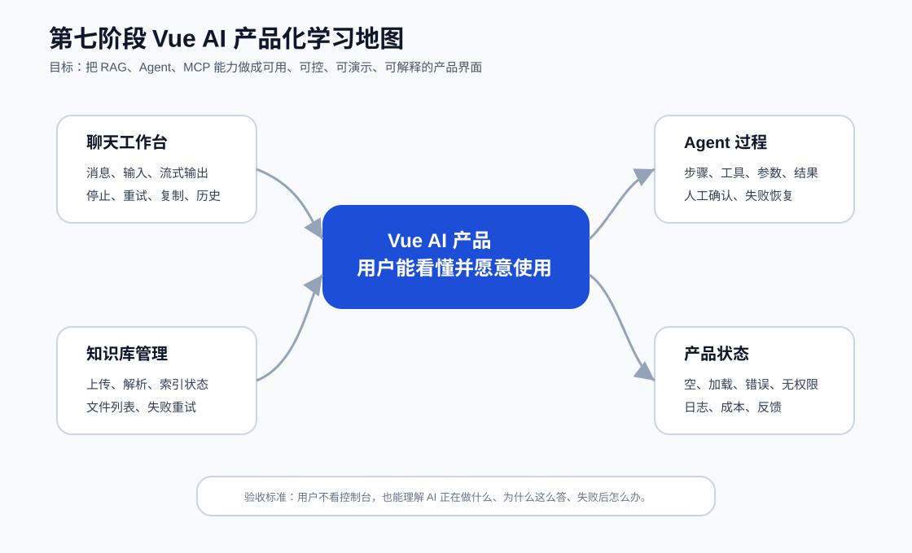
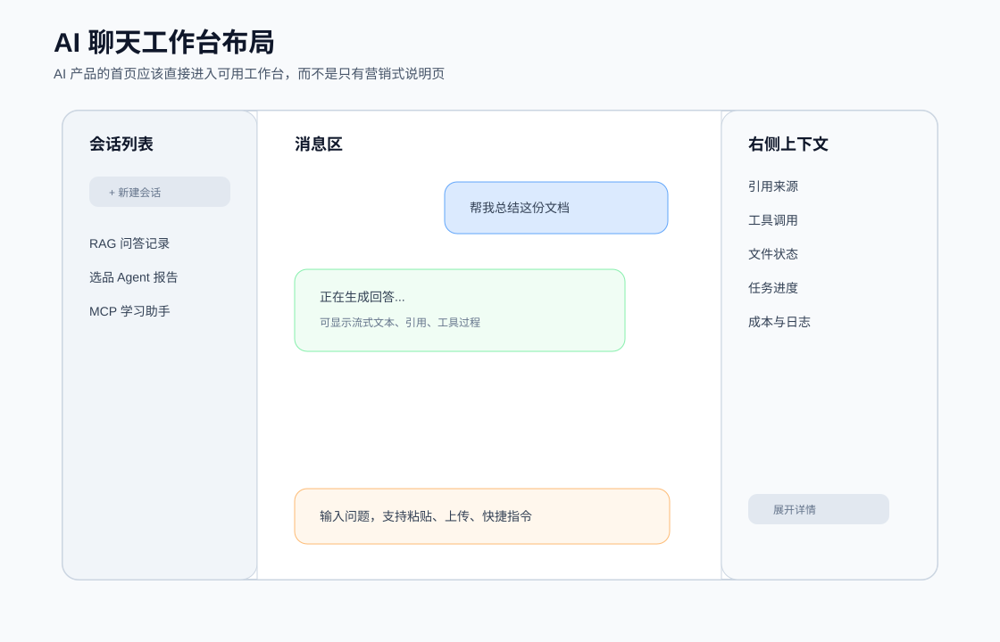
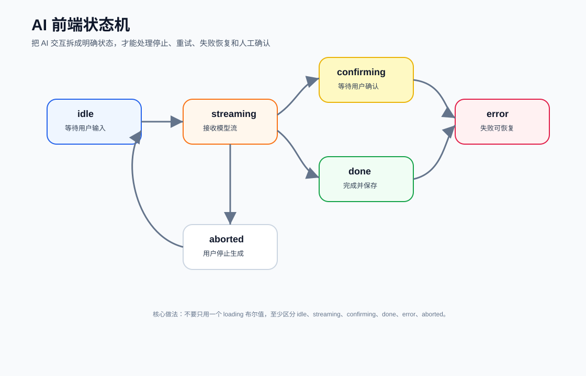
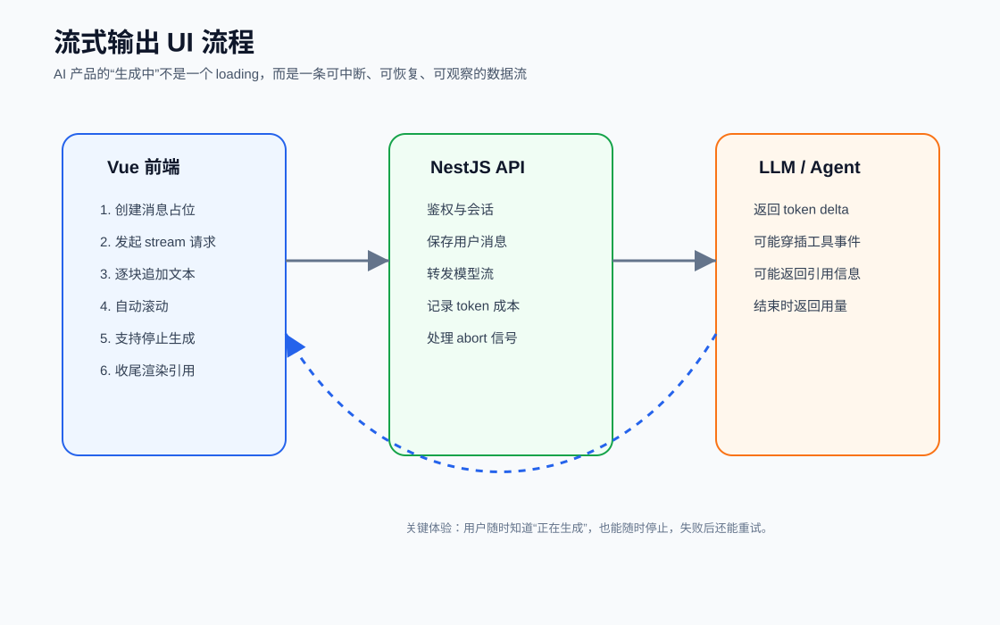
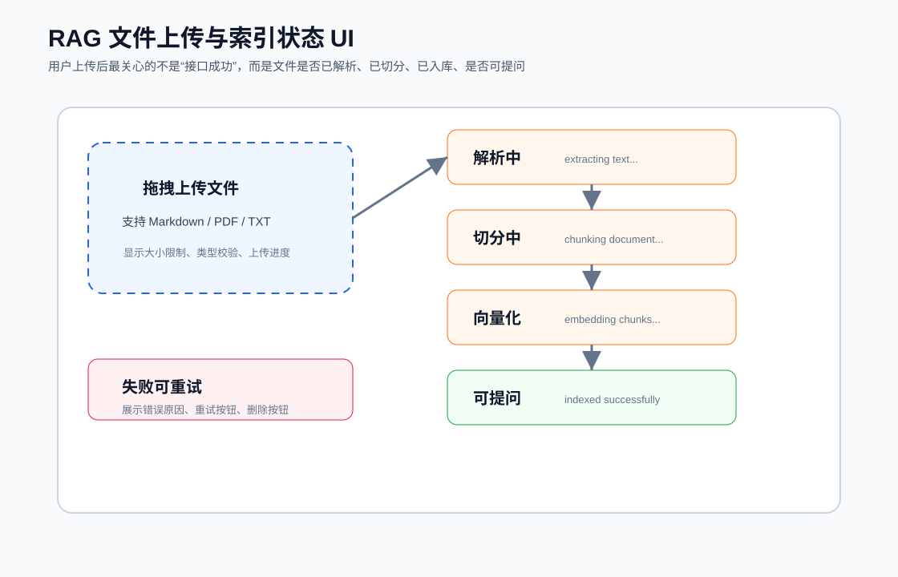
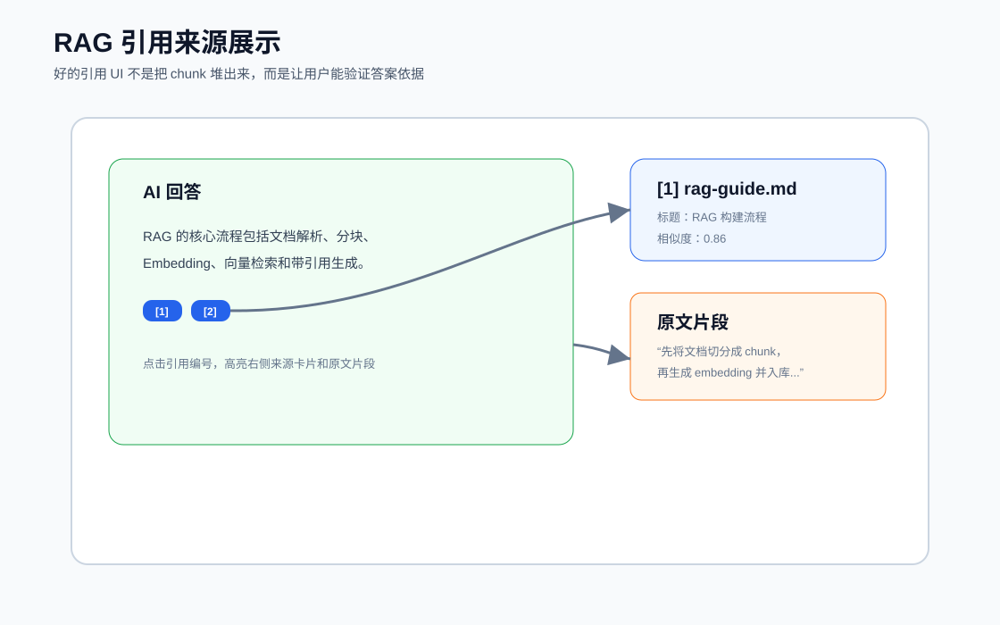
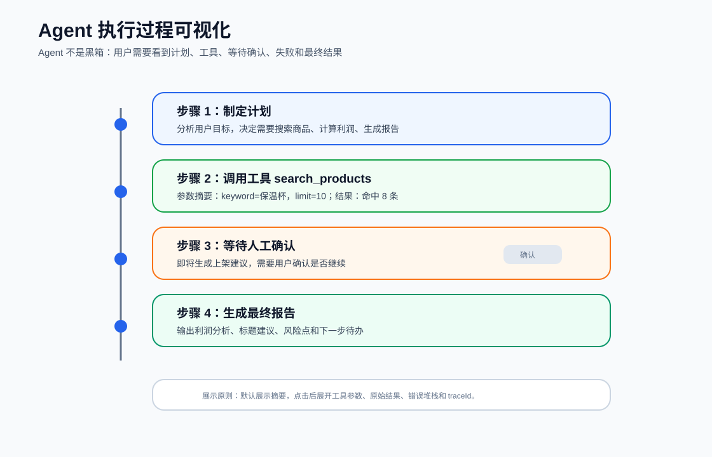
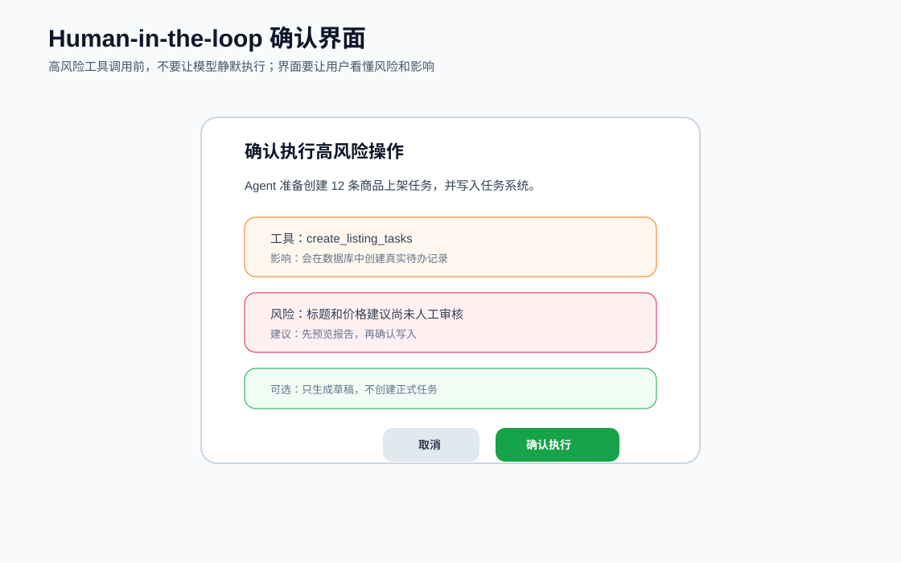
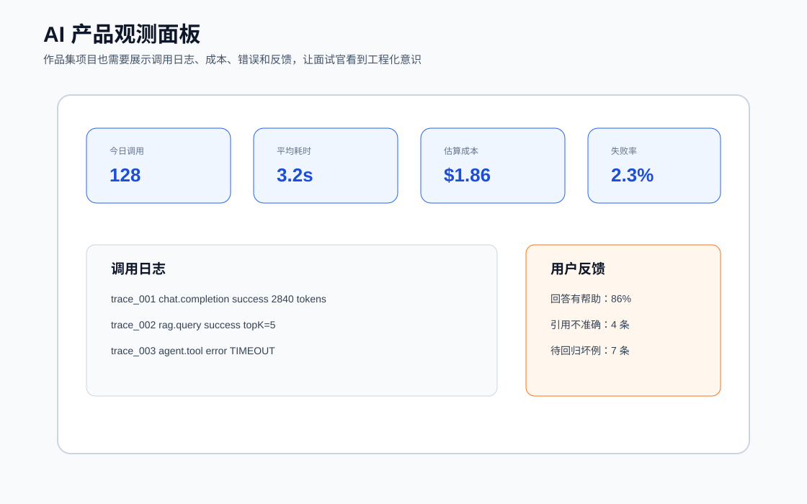

AI 前端和普通前端还是有点区别，普通管理系统常见交互是：用户点击按钮，前端发请求，后端返回结果，页面展示数据。AI 产品更像一个长时间运行的交互过程。用户发起请求后，系统可能会：

1. 创建会话消息。
2. 检索知识库。
3. 调用模型生成回答。
4. 过程中不断返回 token。
5. 中途调用工具。
6. 等待用户确认。
7. 失败后尝试重试或降级。
8. 最后保存回答、引用、工具记录和成本。

所以 AI 前端的核心不是“把接口数据渲染出来”，而是“把一个不确定的 AI 执行过程变得可见、可控、可恢复”。普通 CRUD 更关心：

- 表格。
- 表单。
- 筛选。
- 分页。
- 新增、编辑、删除。
- 权限按钮。

AI 产品更关心：

- 生成过程是否可见。
- 用户能否停止生成。
- 回答是否有依据。
- 工具调用是否透明。
- 高风险操作是否确认。
- 失败后能否恢复。
- 成本和日志是否可追踪。
- 用户反馈能否进入后续优化。



建议使用这套前端技术栈：

```txt
Vue 3
TypeScript
Vite
Vue Router
Pinia
fetch stream / SSE
AbortController
Markdown 渲染
axios
element-plus
代码高亮
文件上传组件
图标库
```

## 1.产品信息架构

首页应该直接是工作台，推荐布局：

- 左侧：会话列表、任务列表、知识库入口。
- 中间：聊天消息和输入区。
- 右侧：引用来源、工具过程、文件状态、成本日志。
- 顶部：当前应用名称、模型选择、用户设置。



这个布局适合同时承载 RAG、Agent、MCP：

- RAG 回答时，右侧显示引用来源。
- Agent 执行时，右侧显示步骤和工具调用。
- MCP 工具调用时，右侧显示工具名称、参数摘要和返回摘要。
- 文件上传后，右侧或知识库页显示索引进度。

建议至少有 5 个页面。

#### ChatPage

用于普通聊天、RAG 问答、Agent 对话。核心功能：

- 会话列表。
- 消息列表。
- 输入区。
- 流式输出。
- 停止生成。
- 重新生成。
- 复制回答。
- 引用来源。
- 工具调用摘要。

#### KnowledgePage

用于管理知识库文档。核心功能：

- 文件上传。
- 文件列表。
- 解析状态。
- chunk 数量。
- embedding 状态。
- 删除文件。
- 重新索引。
- 索引失败重试。

#### AgentTaskPage

用于查看 Agent 任务。核心功能：

- 任务列表。
- 当前状态。
- 执行步骤。
- 工具调用记录。
- 人工确认记录。
- 最终报告。

#### LogsPage

用于查看调用日志。核心功能：

- 模型调用日志。
- RAG 检索日志。
- 工具调用日志。
- token 成本。
- 失败原因。
- traceId 搜索。

#### SettingsPage

用于配置基础参数。核心功能：

- 模型选择。
- 温度。
- topK。
- rerank 开关。
- 是否显示工具详情。
- 是否启用人工确认。
- 默认知识库。

## 2.前端数据模型

AI 产品的前端数据模型要先想清楚。否则页面一多，状态会乱。

下面是一组推荐类型。

### 会话和消息

```ts
export type Conversation = {
  id: string;
  title: string;
  createdAt: string;
  updatedAt: string;
  messageCount: number;
};

export type ChatMessage = {
  id: string;
  conversationId: string;
  role: "user" | "assistant" | "system" | "tool";
  status: "pending" | "streaming" | "done" | "error" | "aborted";
  content: string;
  citations?: Citation[];
  toolCalls?: ToolCallSummary[];
  error?: AiError;
  createdAt: string;
};
```

注意这里不要只存 `content`。AI 消息至少需要 `status`，因为同一条 assistant 消息可能经历：

```txt
pending -> streaming -> done
pending -> streaming -> aborted
pending -> streaming -> error
```

### 引用来源

```ts
export type Citation = {
  id: string;
  sourceId: string;
  title: string;
  fileName: string;
  page?: number;
  heading?: string;
  snippet: string;
  score?: number;
};
```

引用来源要能支持点击跳转或展开原文片段。只有文件名不够，最好还有标题、页码、段落、相似度和片段。

### 工具调用

```ts
export type ToolCallSummary = {
  id: string;
  name: string;
  status: "pending" | "running" | "success" | "error" | "waiting_approval";
  argsSummary: string;
  resultSummary?: string;
  errorMessage?: string;
  startedAt: string;
  endedAt?: string;
};
```

前端不一定要默认展示完整参数和完整结果。建议默认展示摘要，点击后展开详情。

### 文件和索引任务

```ts
export type KnowledgeFile = {
  id: string;
  name: string;
  size: number;
  type: string;
  status:
    | "uploading"
    | "uploaded"
    | "extracting"
    | "chunking"
    | "embedding"
    | "indexed"
    | "failed";
  progress: number;
  chunkCount?: number;
  errorMessage?: string;
  createdAt: string;
};
```

RAG 文件上传不是上传完就结束。用户需要知道文件是否已经能被问答使用。

### Agent 执行步骤

```ts
export type AgentStep = {
  id: string;
  taskId: string;
  type: "plan" | "tool" | "approval" | "reflection" | "final";
  title: string;
  status: "pending" | "running" | "success" | "error" | "skipped";
  summary: string;
  toolCall?: ToolCallSummary;
  requiresApproval?: boolean;
  createdAt: string;
};
```

Agent 前端的关键是把步骤拆开。否则用户只看到“正在执行”，不知道系统到底在做什么。

## 3.AI 前端状态机

AI 前端最常见的错误，是只用一个 `loading` 布尔值。

```ts
const loading = ref(false);
```

这对普通按钮请求够用，但对 AI 产品不够。

你至少要区分：

- `idle`：等待用户输入。
- `pending`：请求已发送，等待首个响应。
- `streaming`：正在接收模型输出。
- `tool_running`：正在执行工具。
- `confirming`：等待人工确认。
- `done`：完成。
- `error`：失败。
- `aborted`：用户停止。



可以定义：

```ts
export type AiRunStatus =
  | "idle"
  | "pending"
  | "streaming"
  | "tool_running"
  | "confirming"
  | "done"
  | "error"
  | "aborted";
```

状态机的价值是：你能清楚决定每个状态下页面应该显示什么。

例如：

- `idle`：输入框可用，发送按钮可点。
- `pending`：输入框禁用，显示“正在连接”。
- `streaming`：显示停止按钮，逐字展示回答。
- `tool_running`：显示工具调用卡片。
- `confirming`：弹出确认框，等待用户决定。
- `done`：显示复制、重试、反馈按钮。
- `error`：显示错误原因和重试按钮。
- `aborted`：显示“已停止”，允许继续追问或重新生成。

## 4.流式输出

流式输出是 AI 产品最基础也最重要的体验之一。

如果用户提问后页面一直转圈，过 20 秒突然出现一大段答案，体验会很差。流式输出能让用户感到系统正在工作，也能更早发现回答方向是否正确。



#### fetch stream

适合前端用 `POST` 提交复杂参数，并接收后端返回的流。

优点：

- 支持 POST。
- 可以传复杂请求体。
- 可以用 AbortController 中断。
- 和普通 fetch 代码接近。

缺点：

- 要自己解析 chunk。
- 后端需要正确设置流式响应。

#### EventSource

适合服务端通过 SSE 持续推送事件。

优点：

- 浏览器原生支持。
- 自动重连机制。
- 事件格式清晰。

缺点：

- 原生 EventSource 主要是 GET。
- 传复杂请求体不方便。
- 中断和鉴权设计要额外考虑。

#### WebSocket

适合双向实时通信，例如多人协作、实时任务看板、复杂 Agent 事件流。

优点：

- 双向通信。
- 适合复杂事件。

缺点：

- 实现和维护成本更高。
- 对普通聊天流式输出来说可能偏重。

先掌握 fetch stream，再理解 SSE 和 WebSocket。

### fetch stream 基础流程

前端流程：

1. 用户点击发送。
2. 创建用户消息。
3. 创建一条空的 assistant 消息。
4. 发起 fetch 请求。
5. 使用 reader 读取流。
6. 每收到一段文本，就追加到 assistant 消息。
7. 完成后把消息状态改为 `done`。
8. 失败则改为 `error`。
9. 用户点击停止时调用 `AbortController.abort()`。

示例 composable：

```ts
import { ref } from "vue";

export function useAiStream() {
  const status = ref<AiRunStatus>("idle");
  const controller = ref<AbortController | null>(null);

  async function start(input: {
    conversationId: string;
    content: string;
    onDelta: (text: string) => void;
    onDone?: () => void;
    onError?: (error: unknown) => void;
  }) {
    controller.value = new AbortController();
    status.value = "pending";

    try {
      const response = await fetch("/api/chat/stream", {
        method: "POST",
        headers: {
          "Content-Type": "application/json",
        },
        body: JSON.stringify({
          conversationId: input.conversationId,
          content: input.content,
        }),
        signal: controller.value.signal,
      });

      if (!response.ok || !response.body) {
        throw new Error("Stream request failed");
      }

      status.value = "streaming";

      const reader = response.body.getReader();
      const decoder = new TextDecoder("utf-8");

      while (true) {
        const { done, value } = await reader.read();
        if (done) break;

        const chunk = decoder.decode(value, { stream: true });
        input.onDelta(chunk);
      }

      status.value = "done";
      input.onDone?.();
    } catch (error) {
      if (controller.value?.signal.aborted) {
        status.value = "aborted";
        return;
      }

      status.value = "error";
      input.onError?.(error);
    } finally {
      controller.value = null;
    }
  }

  function stop() {
    controller.value?.abort();
  }

  return {
    status,
    start,
    stop,
  };
}
```

真实项目里，后端不一定直接返回纯文本，也可能返回事件：

```txt
event: message_delta
data: {"text":"你好"}

event: citation
data: {"sourceId":"doc_1","title":"RAG 指南"}

event: tool_call
data: {"name":"search_notes","status":"running"}

event: done
data: {"usage":{"tokens":1200}}
```

这种情况下，前端需要解析事件类型，并更新不同区域：

- `message_delta` 更新回答正文。
- `citation` 更新引用面板。
- `tool_call` 更新工具过程。
- `done` 更新用量和完成状态。
- `error` 更新错误提示。

### 停止生成

停止生成不是简单隐藏 loading。它应该做几件事：

- 中断当前请求。
- 把当前 assistant 消息标记为 `aborted`。
- 保留已经生成的部分内容。
- 显示“已停止生成”状态。
- 允许用户重新生成或继续追问。

停止后的消息不要直接删除。保留半成品内容对用户有价值，也方便调试。

### 自动滚动

聊天页面通常需要自动滚动到底部，但不能粗暴地每次都滚。

建议规则：

- 如果用户本来就在底部，流式输出时自动滚动。
- 如果用户手动往上看历史，不要强行拉到底。
- 新消息发送时滚到底。
- 回答完成后可以再滚一次。

可以用 `IntersectionObserver` 或滚动位置判断实现。

## 5.RAG 文件上传和索引状态

RAG 产品的文件上传体验，不能只显示“上传成功”。因为上传成功只说明文件到了服务器，不代表它已经能被问答系统使用。一个文档至少要经历：

1. 上传。
2. 文本解析。
3. 清洗。
4. 分块。
5. Embedding。
6. 入向量库。
7. 可检索。



### 文件列表字段

知识库文件列表建议展示：

- 文件名。
- 文件类型。
- 文件大小。
- 上传时间。
- 当前状态。
- 解析进度。
- chunk 数量。
- embedding 数量。
- 失败原因。
- 操作按钮。

状态示例：

```txt
uploading
uploaded
extracting
chunking
embedding
indexed
failed
```

用户最关心的是：

- 这个文件现在能不能问？
- 如果不能，卡在哪一步？
- 如果失败，为什么失败？
- 能不能重试？

### 上传组件设计

上传组件需要包含：

- 拖拽上传。
- 点击选择文件。
- 文件类型限制。
- 文件大小限制。
- 多文件队列。
- 上传进度。
- 取消上传。
- 上传失败重试。

不要只依赖后端报错。前端也应该提前校验：

- 文件是否为空。
- 文件类型是否支持。
- 文件大小是否超过限制。
- 是否重复上传。

### 索引任务状态

后端通常会把解析和 embedding 放到异步任务队列。前端可以通过轮询或事件流更新状态。事件流适合更实时的项目：

```txt
file_uploaded
text_extracted
chunks_created
embedding_started
embedding_progress
indexed
index_failed
```

## 6.RAG 引用来源展示

RAG 答案必须展示引用来源。没有引用来源，用户无法判断答案是否可靠。



### 引用展示的层级

建议分三层：

第一层：回答中的引用标记。

```txt
RAG 的核心流程包括解析、分块、Embedding 和检索。[1][2]
```

第二层：右侧来源卡片。

```txt
[1] rag-guide.md
标题：RAG 构建流程
相似度：0.86
页码：12
```

第三层：可展开原文片段。

```txt
先将文档切分成 chunk，再生成 embedding 并写入向量库...
```

这三层的作用不同：

- 引用标记告诉用户哪句话有依据。
- 来源卡片告诉用户依据来自哪里。
- 原文片段让用户可以验证模型有没有乱说。

### 引用点击交互

建议实现：

- 点击回答里的 `[1]`，右侧高亮对应来源。
- 点击来源卡片，展开原文片段。
- 点击文件名，跳转到文档详情。
- 鼠标悬停引用标记，显示简短来源。

这类细节很加分，因为它体现你知道 RAG 产品不是“把 chunk 拼给模型”这么简单。

### 引用错误状态

要考虑这些情况：

- 回答没有引用。
- 引用文件已删除。
- 引用片段为空。
- 引用和回答不匹配。
- 用户没有权限查看引用文件。

对应 UI：

- 没有引用时显示“本回答未找到可引用来源”。
- 无权限时显示权限提示。
- 引用丢失时显示“来源不可用”。
- 引用不匹配时允许用户反馈。

## 7.Agent 执行过程可视化

Agent 产品最容易犯的错误，是让用户只看到一个长时间 loading。Agent 的价值在于它会做多步任务，所以界面也应该把多步任务展示出来。



### 时间线结构

可以按时间线展示：

- 步骤 1：理解目标。
- 步骤 2：制定计划。
- 步骤 3：调用工具。
- 步骤 4：等待确认。
- 步骤 5：继续执行。
- 步骤 6：生成最终结果。

每个步骤至少包含：

- 标题。
- 状态。
- 摘要。
- 开始时间。
- 结束时间。
- 是否可展开。

工具步骤还要包含：

- 工具名称。
- 参数摘要。
- 返回摘要。
- 错误信息。
- traceId。

### 默认摘要，按需展开

不要默认把完整 JSON 参数和返回结果全部显示给用户。这样会显得很乱。推荐：

- 默认展示自然语言摘要。
- 技术用户可以点击展开 JSON。
- 错误时默认展示错误原因。
- traceId 放在详情里，方便复制给开发者排查。

### 工具调用状态

工具调用状态建议统一：

```txt
pending
running
success
error
waiting_approval
skipped
```

UI 对应：

- `pending`：灰色等待。
- `running`：显示进度或旋转状态。
- `success`：绿色完成。
- `error`：红色错误，可重试。
- `waiting_approval`：黄色提示，显示确认按钮。
- `skipped`：灰色跳过，显示原因。

## 8.Human-in-the-loop 交互

Agent 不应该静默执行所有操作。只要操作有风险，就应该让用户确认。高风险操作包括：

- 写数据库。
- 创建订单。
- 发送邮件。
- 删除文件。
- 修改商品价格。
- 发布内容。
- 调用付费 API。
- 批量创建任务。



### 确认弹窗要展示什么

确认弹窗不是只问“是否继续”。应该展示：

- 即将执行的工具。
- 参数摘要。
- 会影响哪些对象。
- 是否可撤销。
- 风险提示。
- 取消按钮。
- 确认按钮。
- 可选替代方案。

例如：

```txt
Agent 准备创建 12 条商品上架任务。

工具：create_listing_tasks
影响：会在任务系统中创建真实记录
风险：标题和价格建议尚未人工审核
建议：先生成草稿，再确认写入
```

### 前端状态流

人工确认的状态流：

```txt
tool_running -> waiting_approval -> approved -> tool_running -> success
tool_running -> waiting_approval -> rejected -> skipped
```

用户拒绝后，不一定整个任务失败。Agent 可以继续生成报告，只是跳过写入操作。

### 确认记录要保存

建议保存：

- 谁确认的。
- 确认时间。
- 确认的工具。
- 参数摘要。
- 用户选择：同意或拒绝。
- 后续执行结果。

这样项目看起来就不只是 demo，而是有真实业务系统的审计意识。

## 9.错误、空状态和恢复

AI 产品的失败很多，不要只弹一个“请求失败”。

常见错误包括：

- 模型 API 超时。
- 模型额度不足。
- 后端连接失败。
- RAG 没有检索到内容。
- 文件解析失败。
- 工具调用失败。
- 用户无权限访问文件。
- 输出 JSON 解析失败。
- 用户停止生成。

### 错误分类

建议统一错误类型：

```ts
export type AiErrorCode =
  | "NETWORK_ERROR"
  | "MODEL_TIMEOUT"
  | "RATE_LIMITED"
  | "NO_RETRIEVAL_RESULT"
  | "FILE_PARSE_FAILED"
  | "TOOL_CALL_FAILED"
  | "PERMISSION_DENIED"
  | "OUTPUT_VALIDATION_FAILED"
  | "USER_ABORTED";
```

前端要根据错误类型给出不同动作：

- 网络错误：重试。
- 模型超时：重新生成或切换模型。
- 没有检索结果：提示换关键词或上传资料。
- 文件解析失败：重新解析或删除文件。
- 权限不足：申请权限或切换知识库。
- 用户停止：保留内容并允许继续。

### 空状态

空状态不是写一句“暂无数据”。

不同页面的空状态应该不同：

- 没有会话：显示新建会话入口。
- 没有知识库文件：显示上传入口。
- 没有 Agent 任务：显示创建任务入口。
- 没有日志：提示执行一次问答后会出现日志。
- 没有引用：提示当前回答没有检索到可靠来源。

空状态要引导下一步动作。

### 失败恢复

每个失败状态都要考虑是否可恢复：

- 聊天失败：重新生成。
- 工具失败：重试该步骤。
- 文件解析失败：重新解析。
- embedding 失败：重新入库。
- 人工确认拒绝：跳过该操作。

AI 产品可用性的关键，不是永远不失败，而是失败后用户知道怎么办。

## 10.观测和成本展示



### 调用日志字段

建议前端日志列表展示：

- traceId。
- 会话 ID。
- 模型名称。
- 请求类型。
- 输入 token。
- 输出 token。
- 估算成本。
- 耗时。
- 状态。
- 错误码。
- 创建时间。

### 工具日志字段

Agent 工具日志展示：

- traceId。
- toolName。
- argsSummary。
- resultSummary。
- status。
- latencyMs。
- errorCode。
- requiresApproval。

### 用户反馈

每条回答建议提供反馈：

- 有帮助。
- 没帮助。
- 引用不准确。
- 回答太泛。
- 回答错误。

### 聊天流接口

请求：

```http
POST /api/chat/stream
Content-Type: application/json
```

```json
{
  "conversationId": "conv_001",
  "message": "帮我总结这份文档",
  "knowledgeBaseId": "kb_001",
  "mode": "rag"
}
```

返回事件：

```txt
message_delta
citation
tool_call_started
tool_call_finished
usage
done
error
```

### 文件上传接口

```http
POST /api/knowledge/files
GET /api/knowledge/files
GET /api/knowledge/files/:id
POST /api/knowledge/files/:id/reindex
DELETE /api/knowledge/files/:id
```

### Agent 任务接口

```http
POST /api/agent/tasks
GET /api/agent/tasks
GET /api/agent/tasks/:id
POST /api/agent/tasks/:id/approve
POST /api/agent/tasks/:id/reject
POST /api/agent/tasks/:id/retry
```

### 日志接口

```http
GET /api/logs/model-calls
GET /api/logs/tool-calls
GET /api/logs/tasks/:traceId
```

接口契约越清晰，前端越容易做出稳定体验。

## 参考资料

- [Vue 官方文档](https://vuejs.org/guide/introduction.html)
- [Vue TypeScript 指南](https://vuejs.org/guide/typescript/overview.html)
- [Vue Router 官方文档](https://router.vuejs.org/guide/)
- [Pinia 官方文档](https://pinia.vuejs.org/)
- [Vite 官方文档](https://vite.dev/guide/)
- [MDN Streams API](https://developer.mozilla.org/en-US/docs/Web/API/Streams_API)
- [MDN AbortController](https://developer.mozilla.org/en-US/docs/Web/API/AbortController)
- [MDN EventSource](https://developer.mozilla.org/en-US/docs/Web/API/EventSource)
