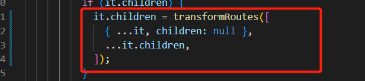
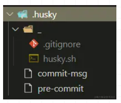

## 文件结构设计
简单说下组件的结构类型，其他路由文件，测试文件，文档文件都可以用代码命令自动生成
```
 Component
│   ├── __tests__
│   │   └── Component.spec.js  测试用例
│   ├── demo
│   │   └── index.vue  demo演示
│   ├── index.ts 入口文件
│   └── src
│       ├── Component.tsx 逻辑实现
│       ├── Types.ts 类型定义
│       ├── index.less 样式控制
│       └── var.less 变量控制
```
一个组件库包含的所有东西都在该模板中，但是eslint等可以参考下面文档自行配置，组件库采用的是`vue3+ts+vite+vitest`[组件模板](https://github.com/limingkang/componentPackageTemplate)

## 单元测试
我们可以使用jest来集成并管理所有的测试环境，例如包括覆盖率、集成测试等，但是和vue的单元测试还是得通过下面包来连接vue进行单元测试，这里
不安装集成环境，直接做单元测试，环境基于`vitest + @vue/test-utils`，大概安装配置如下
``` js
// npm i -D vitest @vue/test-utils happy-dom @vitest/coverage-v8
import { defineConfig } from 'vitest/config'
import vue from '@vitejs/plugin-vue'

export default defineConfig({
  plugins: [vue()],

  // 新增测试基于的dom环境
  test: {
    environment: 'happy-dom'
  }
})
```
``` json
"scripts": {
    "dev": "vite",
    "build": "vue-tsc && vite build",
    "preview": "vite preview",

    // 新增
    "test": "vitest"
},
```
我们可以去测试工具函数、组件行为、点击交互等，模板中有示例，也可以直接参考[test-utils](https://test-utils.vuejs.org/api/#wrapper-methods)

## 开发规范
所谓规范无外乎就是几个方面，代码开发格式化方案，代码提交时候的规范检查，以及提交commit的格式的检测
### ESLint 和 Prettier
这两个有相同地方，也有其不同的点，一般组合使用，也可以只用一个，总结来说eslint和prettier这俩兄弟一个保证js代码质量一个保证代码美观
- eslint针对的是javascript他是一个检测工具包含js语法以及少部分格式问题在eslint看来语法对了就能保证代码正常允许格式问题属于其次
- prettier属于格式化工具它看不惯格式不统一所以它就把eslint没干好的事接着干另外prettier支持包含js在内的**多种语言**
例如eslint并不能格式化类似下面这种情况而这里就是prettier发挥作用的主战场,可以将下面代码格式化成一行


接下来看下我们如何安装一个eslint
``` shell
npm i eslint --save-dev
npm init @eslint/config
# 此时会让我们选择三个问题，我们依次选择
# enforce code style
# javascript modules
# vue

# 直接运行eslint 检测某个文件
npx eslint ./src/index.js
```
选择后就会生成一个文件.eslintrc.js,由于我添加了ts所以默认也会添加`@typescript-eslint`我们会发现package.json多了几个插
件`@typescript-eslint/eslint-plugin、@typescript-eslint/parser`并且要安装`npm i typescript --save-dev`eslint规则是自
己默认选择的配置，当然我们也可以根据提示选择比较著名的格式配置文件例如Airbnb风格

我们也可以配置项目启动时检测eslint来报错，例如如果你使用的是webpack你可以用对应插件来完成该功能
``` js
const ESLintPlugin = require('eslint-webpack-plugin');
module.exports = {
  plugins: [
    new ESLintPlugin()
  ]
}
``` 
除了eslint-webpack-plugin的插件帮我们在代码运行时就可以检测出代码的一些不规范问题，我们通常可以结合vscode插件例如eslint帮我更友好的提示,我们需要在
写代码的时候，编辑器就已经给我们提示错误

如果要 eslint搭配prettier使用，可以按照以下步骤
1. 首先安装插件eslint-config-prettier和eslint-plugin-prettier
2. 其次配置.eslintrc.json文件`extends: ["plugin:prettier/recommended"]`如果有其他扩展则`plugin:prettier/recommended`放在最后
3. 新增.prettierrc文件可以新增规则对.eslintrc.json的rules进行覆盖

这里的执行逻辑顺序是eslint会首先读extends的规则这个时候遇到了最后配置的`plugin:prettier/recommended`而这个插件又会先读本地配置的.prettierrc文件
再读取prettier自己内部设置的配置最后读.eslintrc.json的rules配置。所以.eslintrc.json的rules优先级最高可以覆盖.prettierrc的部分配置

**优先级本地.eslintrc.json的rules > 本地.prettierrc>prettier内部配置>extends其他配置>eslintrc内部默认配置**

但是如果.eslintrc.json和.prettierrc配置冲突了，就会出现各种返回格式化的问题，这种情况可以参考[文档](https://zhuanlan.zhihu.com/p/347339865)，不然就是
解决冲突的配置，以某个配置为主

### Husky
[Husky](https://github.com/typicode/husky)就是一个创建或修改 Git hooks 的工具，它在内部封装了 git hook，允许我们在提交代码时运行一些额外的脚本。比如校验规范，格式化代码等
``` js
// 初始化husky
npm i husky -D
{
    "scripts": {
        // ......
        "prepare": "husky install"
    }
}
// 执行命令会创建.husky 文件夹，此时git hook已被启用
npm run prepare
// 使用husky add <file> [cmd]命令往里面添加 hook
// <file>: 指名为 git hook 的文件，通常放在 .husky/ 目录下。比如：.husky/pre-commit 
// [cmd]: 指想要运行的命令。比如：npm run lint:eslint
npx husky add .husky/pre-commit "npm run test"
```
当你尝试 commit 提交时，pre-commit hook 会提前执行其中的 npm run test，如果检测失败，那么本次提交会被自动阻止。当然，你可
以根据自己的需求修改这个 shell 脚本,我们也可以使用官方推荐的方法一次性快速初始化 husky`npx husky-init && npm install`
该命令会自动初始化并生成 pre-commit 脚本，我们只需直接去里面修改内容即可，很方便

这里有个问题`npm run lint:eslint`会对你自定义的所有文件进行 ESLint 修改，成本显然很高。所以 lint-staged 的出现允许你每
次 commit 时只对当前添加到暂存区（stage）的代码进行 lint，效率大大提高

lint-staged 的配置方式有两大种，支持 package.json 或 JSON 和 YML 风格的 .lintstagedrc ,以 package 为例
``` js
{
  "lint-staged": {
    "<glob-pattern>": "<command>"
  }
}
// command 可以是原生的工具库命令，也可以是 Scripts 里的自定义命令。原生命令可以省略 npm run
// 前缀，但自定义命令必须是完整的，比如 eslint --fix 和 npm run lint:eslint，例如如下配置

{
    "lint-staged": {
        "packages/**/__tests__/*.ts": "npm run test",
        "packages/**/*.ts": [
            "npm run lint:eslint", // scripts 自定义的命令
            "prettier --write" // prettier 原生的命令
        ]
    }
}
// 所有 packages 下的单元测试文件在提交前，都要执行 jest 测试
// 所有 packages 下的 .ts 文件都要执行 eslint 校验以及 prettier 格式化
```
不过目前它还不能自动生效，要在`.husky/pre-commit`脚本中修改并添加`npx --no-install lint-staged`命令，这样就生效了
``` bash
#!/usr/bin/env sh
. "$(dirname -- "$0")/_/husky.sh"

echo -e "\033[33m ------------------- 正在对提交的代码执行操作 -------------------- \033[0m"
npx --no-install lint-staged
```

### commitlint
commitlint 用来约束提交信息，规范提交格式
1. 安装`npm i @commitlint/config-conventional @commitlint/cli -D`
2. 自定义 commitlint.config.js 规范
``` js
module.exports = {
    ignores: [commit => commit.includes('init')],
    extends: ['@commitlint/config-conventional'],
    rules: {
        'body-leading-blank': [2, 'always'], // 主体前有空行
        'footer-leading-blank': [1, 'always'], // 末行前有空行
        'header-max-length': [2, 'always', 108], // 首行最大长度
        'subject-empty': [2, 'never'], // 标题不可为空
        'type-empty': [2, 'never'], // 类型不可为空
        'type-enum': [ // 允许的类型
            2,
            'always',
            [
                'wip', // 开发中
                'feat', // 新增功能
                'merge', // 代码合并
                'fix', // bug 修复
                'test', // 测试
                'refactor', // 重构
                'build', // 构造工具、外部依赖（webpack、npm）
                'docs', // 文档
                'perf', // 性能优化
                'style', // 代码风格（不影响代码含义）
                'ci', // 修改项目继续集成流程（Travis，Jenkins，GitLab CI，Circle等）
                'chore', // 不涉及 src、test 的其他修改（构建过程或辅助工具的变更）
                'workflow', // 流水线
                'revert', // 回退
                'types', // 类型声明
                'release', // 版本发布
            ],
        ],
    },
};
```
使用 husky 继续添加`commit-msg git hook`
``` bash
npx husky add .husky/commit-msg 'npx --no-install commitlint --edit "$1"'
```
现在目录大概这样，我们可以提交下commit来做个测试


## 私有npm库
在开发npm包的时候，我们可以考虑搭建一个私有仓库，目前市面上有两种成熟做法，一个是使用[Verdaccio](https://verdaccio.org/docs/what-is-verdaccio/)，另一个是Nexus。由
于Verdaccio属于Nodej.s技术生态,所以本文着重介绍Verdaccio的搭建和使用
``` shell
# 使用npm安装，node版本需在16及以上
sudo npm install --location=global verdaccio@next
# 使用pm2做进程守护：
pm2 start "verdaccio" --name verdaccio

# 或者使用docker安装，先拉取镜像：
docker pull verdaccio/verdaccio
# 然后运行容器：
docker run -it --rm --name verdaccio -p 4873:4873 verdaccio/verdaccio
```
启动成功之后，输入端口号可以看到当前页面

官网的文档上我们可以知道，在 verdaccio的默认配置和我们在真正生产上用到的还是不一样的。我们需要对默认的verdaccio配置做一下修改,找到
config.yaml文件是默认的配置文件,4873端口表示默认端口
``` yaml
# storage 已发布的包的存储位置
storage: ../storage
# plugins 插件所在的目录
plugins: ../plugins
# web 界面相关的配置
web:
title: Verdaccio
i18n:
web: zh-CN
# auth 用户相关，例如注册、鉴权插件（默认使用的是 `htpasswd`），其中max-users为-1会禁止npm add user，只能在htpasswd文件中添加用户
auth:
htpasswd:
 file: ./htpasswd
 max-users: -1
# 果不设置max_users的话，注册用户是没有限制的，也就是说，当部署到外网环境后，任何人都可以通过添加用户的命令注册用户。当我们将max_users 设
# 置为-1 就设置为了禁用注册用户。当想要设置注册用户的话，就可以将max_users 的值设置为大于0的值
# uplinks 用于提供对外部包的访问，例如访问 npm、cnpm 对应的源
uplinks:
npmjs:
 url: https://registry.npmmirror.com
# packages 用于配置发布包、删除包、查看包的权限
# access 控制包的访问权限 
# publish 控制包的发布权限
# unpublish 控制包的删除权限
# `$all`（所有人）、`$anonymous`（未注册用户）、`$authenticated`（注册用户），也可以设置为指定用户，多个用户可以用空格分开
packages:
'@mycompay/*':
 access: $authenticated
 publish: $authenticated
 unpublish: admin userA
'@*/*':
 access: $authenticated
 publish: $authenticated
 unpublish: $authenticated 
 proxy: npmjs
'**':
 access: $authenticated
 publish: $authenticated
 unpublish: $authenticated
 proxy: npmjs
# server 私有库服务端相关的配置
server:
keepAliveTimeout: 60
VERDACCIO_PUBLIC_URL: 'registry.npm.1000phone.com'
# middlewares 中间件相关配置，默认会引入 `auit` 中间件，来支持 `npm audit` 命令
middlewares:
audit:
 enabled: true
# Verdaccio 是支持搜索功能的，它是由 `search` 控制的，默认为 `false`，所以这里我们需要开启它
search: true
# logs 终端输出的信息的配置
logs: { type: file, path: /verdaccio/storage/.runtime/verdaccio.log, level: info }
     #- { type: stdout, format: pretty, level: info }
# listen 设置监听的端口号，不设置只能本地访问
listen:
- 127.0.0.1:4873
```
我们可以使用命令注册个用户
``` shell
npm adduser --registry http://localhost:4873/
```
## 参考链接
[eslint](https://zhuanlan.zhihu.com/p/655224242)

[eslint和prettier](http://681314.com/A/LRrhrHAxYy)

[配置verdaccio](https://blog.51cto.com/u_12227788/6144319)

[单元测试](https://zhuanlan.zhihu.com/p/643446343)
