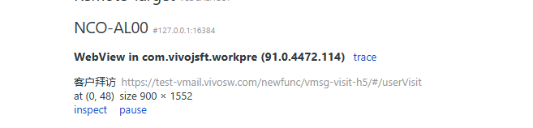

## 交互原理
无论什么版本，android的通信方式都比较简单，只需要直接在window上挂载个全局变量供js使用即可,ios的交互方式大概有以下几种
1. 拦截url（适用于UIWebView和WKWebView）
2. JavaScriptCore（只适用于UIWebView，iOS7+，古老的方式，基本弃用了）
3. WKScriptMessageHandler（只适用于WKWebView，iOS8+）
4. WebViewJavascriptBridge（适用于UIWebView和WKWebView，属于第三方框架，例如DSBridge等框架）

拦截url的形式就是和开发协定好协议，如iosaction://scan表示启动二维码扫描，iosaction://location表示获取定位，webview内核实
现对url的拦截，来判定是否是调用对应的原生方法

现在很多 app 都是支持iOS8+，很多人使用WKWebView代替了UIWebView，但是WKWebView并不支持方法二。此时我们可以使用WKWebView的
WKScriptMessageHandler，例如调用扫码方法`window.webkit.messageHandlers.scan.postMessage()`的方式对scan 方法发送消息


## 代码设计实现
``` js
// 大概的文件结构，可以这样设计
src
├─core  
    ├─callback.js
    ├─err.js
├─natives
    ├─app.js
    ├─app2.js
├─env.js
├─index.js
```

### 入口文件设计
入口文件的设计，我们需要考虑到以下几点必须得功能，代码在下面
- 判断环境来使用不同的sdk
- 调用方法统一编译监控
- 导出公共方法例如判断环境方法、当前环境变量、方法劫持回调和超时时间配置等
- 当然我们还可以加入更多的可配置方法例如支持调用前参数改造，回调值参数改造，类似与实现axios.interceptors.request.use和response功能
``` js
// 先单独搞个工具类文件，来专门判断当前所处的环境，根据业务需要可以再加入其他环境判断
function getEnvByUa() {
    let env = {};
    const ua = window.navigator.userAgent;
    env = {
        isWeixin: /micromessenger/i.test(ua),
        isAndroid: /android/i.test(ua),
        isAliMP: ua.indexOf('AlipayClient') > -1 && ua.indexOf('MiniProgram') > -1,
        isAliMPMonitor: ua.indexOf('AlipayClient') > -1 && ua.indexOf('AlipayIDE') > -1,
        isIOS: /iPad|iPhone|iPod/i.test(ua),
        isWeibo: /weibo/i.test(ua),
        isQQ: /QQ/i.test(ua),
        isEasySelfApp: false,
        isAlipayBrowser: false,
        // ios版本
        iosVersion: null,
    };
    // 支付宝浏览器
    env.isAlipayBrowser = !env.isAliMPMonitor && !env.isAliMP && /AlipayClient/i.test(ua);
    // 获取ios版本
    if (env.isIOS) {
        const matches = ua.toLocaleLowerCase().match(/cpu iphone os (.*?) like mac os/i);
        env.iosVersion = matches && matches[1].replace(/_/g, '.');
    }
    // 自己公司的app版本
    const matches = ua.match(/\b\s*app=selfapp(?:;\s*version=([\d\.]+))*/i);
    if (matches) {
        env.isEasySelfApp = true;
        [, env.appVersion] = matches;
        if (!env.appVersion) {
        env.appVersion = '0.0.0';
        }
    }
}
const env = getEnvByUa();
export { getEnvByUa }
export default env
```

``` js
// 接下来设计下我们的入口文件
import env, { getEnvByUa } from './env';
import { appCallNative } from './natives/app';
// 所有的方法都是走这个方法进行分发,对于超大sdk我们参数大概这样分层设计
// method方法名称，data参数名称，classMap方法在哪个类下面，timeout是否需要超时截断
let outTime = 8000;
const ProxyArrCallback = [];
function doCallback(method, status) {
    ProxyArrCallback.forEach((item) => {
        item(method, status)
    })
}
function callNative(method, data, classMap, timeout = true) {
  return new Promise((resolve, reject) => {
    let tiemer = null;
    if (timeout) {
      tiemer = setTimeout(() => {
        doCallback(method, 'timeout')
        return reject();
      }, outTime);
    }
    doCallback(method, 'start')
    // 假设判断出是自己app
    if (env.isEasySelfApp) {
      return appCallNative(classMap, method, data).then((data) => {
        doCallback(method, 'success')
        resolve(data)
      }).catch((e) => {
        doCallback(method, 'fail')
        reject(e);
      }).then(() => clearTimeout(tiemer));
    }
    // 可以加入其他环境判断，引入不同文件方法
  });
}
class NativeAll {
    /**
     * 写个获取登录信息的方法
     * @returns {PromiseLike<T | never> | Promise<T | never>}
     */
    getTokenAndKey(params) {
        return callNative(
        'getTokenAndKey', params, 'User',
        ).then((result) => {
            if (!result.token) {
                return Promise.reject(new Error('未登录'));
            }
            return result || {};
        });
    }
}
// 设置超时时间
function setOutTime(time = 8000) {
    outTime = time;
}
// 设置每个方法的劫持，编译做些监控等，可以加入很多个监听函数
function setProxyMethod(callback) {
    if(Object.prototype.toString.call(callback) === '[object Function]') {
        ProxyArrCallback.push(callback);
    }
}
const Native = new NativeAll();
export default Native;
export {
  env,
  Native,
  setOutTime,
  setProxyMethod
}
```
接下来实现某个环境下sdk，写个app的例子，其他环境下都是类似
``` js
import env from '../env';
import addCallback from '../core/callback';

const callNative = (classMap, method, params = {}) => new Promise((resolve, reject) => {
  if (!isSupported(method)) { // 可以写个文件来保存支持的方法，每次校验下
    reject(new Error('APP版本过低不支持此方法'));
    return;
  }
  // 回调函数构造
  const id = addCallback({
    resolve,
    reject,
  });
  const data = {
    classMap,
    method,
    params: params === null ? '' : JSON.stringify(params),
    callbackId: id.toString(),
  };
  const dataStr = JSON.stringify(data);
  if (env.isIOS) {
    window.webkit.messageHandlers.callNative.postMessage(dataStr);
  } else {
    window.AppFunctions.callNative(dataStr);
  }
});
const native = {
  call(params) {
    return callNative('SystemUtil', 'call', params);
  },
}
export const appCallNative = (classMap, method, data) => {
  // 需要特别处理的方法可以这样再转一次，否则直接调用即可
  if (native[method]) {
    return native[method].call(native, data);
  }
  return callNative(classMap, method, data);
};

export default native;
```
到此已经写好了调用原生的方法，接下来就是如何触发回调，也就是上面的callback.js的实现
``` js
let __id = 0;
const __callbacks = {};
// 原生约定好，成功之后触发全局的callback方法
if (window.callBack) { //防止多次引入该sdk
  console.error('您项目中window下已经挂载了callBack方法，回调会出现异常');
}
window.callBack = function callBack(data) {
  const {
    callbackId,
  } = data;
  const callback = __callbacks[callbackId]; // 取到对应保存的回调函数promise

  if (callback) {
    if (data.code === 0) {
      callback.resolve(data.data);
    } else {
      const error = new Error(data.msg);
      error.response = data;
      callback.reject(error);
    }
    // 触发完的回调函数删除
    delete __callbacks[callbackId];
  }
};

export default ({ resolve, reject }) => {
  const obj = {
    resolve,
    reject,
  };
  if (process.env.NODE_ENV !== 'pro') {
    obj.timestamp = Date.now();
  }
  // 构造回调函数id，并写入到对象，触发callback时候传回该id
  const id = __id;
  __callbacks[id] = obj;
  __id += 1;
  return id;
};

```

## 调试app内嵌的h5
这里只针对android手机，做讲解介绍，ios限制太多，大家可以自己研究

### 开发者模式打开
通过打开开发者模式，我们可以很容易分辨出该页面是h5页面，还是原生写的页面
1. 打开手机或者模拟器进入系统设置页面，步骤为：“设置” --》 “系统管理” --》“关于手机” --》“版本信息”
2. 进入版本信息页面之后，连续点击“软件版本号”，直到出现上面这个提示“您已处于开发者模式，无需进行此操作”
3. 之后回到系统管理界面，就会出现开发者模式
4. 点击进入开发者选项，打开里面的“USB调试开关”,以及“显示布局边界”开关，注意模拟器只需要打开布局边界即可

### 安装adb
1. 现在最新安装包[地址](https://dl.google.com/android/repository/platform-tools-latest-windows.zip)
2. 解压缩到任意位置
3. 打开“文件资源管理器“，选择“此电脑”，右键选择“属性”，选择“高级系统设置”，选择“环境变量”
4. 系统变量中找到“Path”,选择编辑新增一个环境变量
5. 地址填写为adb解压缩到的地址，例如我解压缩到d盘，地址如下D:\platform-tools
6. 通过命令"adb version"查看版本，如果显示版本则安装成功

### 调试
1. 我们可以使用手机插use调试，或者使用[MuMu模拟器](https://mumu.163.com/)
2. 电脑上安装edge浏览器，用来调试webview，使用chrome浏览器调试时候需要翻墙 
3. 使用模拟器安装需要调试的app对应的apk文件，注意该apk包打包时候必须设置了允许js调试，大概如下
``` js
setJavaScriptEnabled(boolean flag) // 支持js
WebView.setWebContentsDebuggingEnabled(true) // 设置debug调试
``` 
4. 模拟器设置好开发者模式，设置方式同上，并查看下模拟器的调试端口号，设置 => 问题诊断 => 找到端口号这里是16384
5. adb链接模拟器进行调试，mumu模拟器端口一般是16384，运行命令`adb connect 127.0.0.1:16384`
6. 运行下adb devices看是否链接成功到当前模拟器，如果没成功则stop之后再adb start server 再connect
7. 打开任意一个app，进入其内部h5页面
8. 打开edge浏览器，输入地址edge://inspect/#devices
9. 等待一会，会显示当前h5页面的详细地址，大概如下，如果不显示地址，则说明apk包的设置有问题，得重新打apk包

10. 点击inspect，即可用浏览器打开该h5页面并开启了开发者模式，此时我们可以正常看到该页面内dom元素，请求等和在chrome上调试一样
11. 启动之后我们在刚刚edge浏览器打开的页面，把地址直接替换成本地的，即可开始本地调试代码，此时native等方法的调用都是可用状态，即自动会带上登录信息


